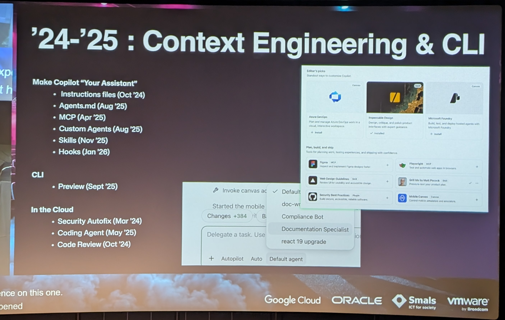
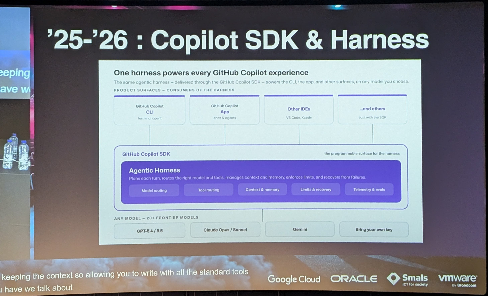
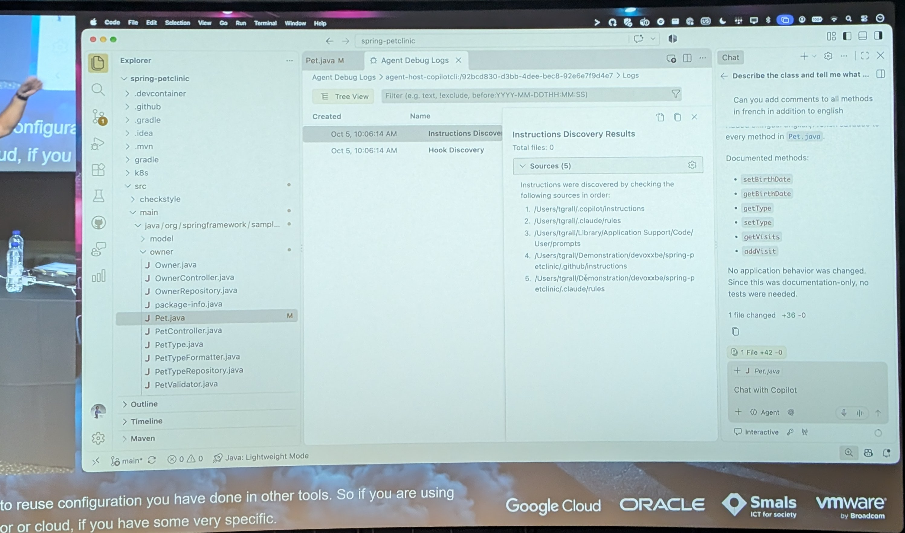
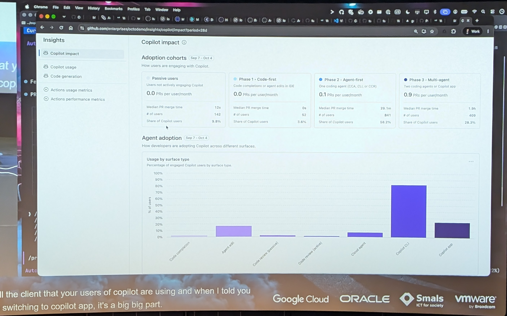

# 09:30 Auto complet -> Auto pilot

[▶ Video](https://youtu.be/pMv_39iSXVA)

[From Autocomplete to Autopilot: How AI Is Changing the Developer Experience](https://m.devoxx.com/events/dvbe26/talks/23529/from-autocomplete-to-autopilot-how-ai-is-changing-the-developer-experience) by [Tugdual Grall](https://m.devoxx.com/events/dvbe26/speaker/23042/tugdual-grall)
Room 8 · Deep Dive · 09:30-12:30

## Summary

This talk explores the rise of agentic workflows and context engineering in AI-assisted development. Using GitHub Copilot’s latest tools, it shows how teams delegate end-to-end tasks, from architecture scaffolding to PRs, and how developers, SREs, DevOps, and PMs shift from writing code to expressing intent.

## Key points ⭐

- 38:00 RTK, Many tool to save token
- 42:00 Hooks + Agent Debug logs (in VS code)
- 56:51 Tips use CLI in VS code
- 1:36:00 copilot impact explained
- 2:09:00 Rowork [?] setup
- 2:13:00 Project > setting -> Security -> codeQL

## Timeline

### [04:21](https://youtu.be/pMv_39iSXVA?t=261)
- copilot CLI 10 people
  - -> 500 PR/week
- quality + security needed (in CI ?)

### [07:30](https://youtu.be/pMv_39iSXVA?t=450)
- We want new feature -> so more PR
- But in a Bank App do you want new Feature every Day
  - -> No you want security / stability

### [09:39](https://youtu.be/pMv_39iSXVA?t=579) [?]
- Blog article Migration GHCP to Runtime Rust
- copilot chat Feb 23
- Agent Mode Feb 25

### [17:00](https://youtu.be/pMv_39iSXVA?t=1020)
- Harness become better on Delta
- we have less need on skills Md file
  - -> No need to explain How to write java (to be challenge)

### [20:00](https://youtu.be/pMv_39iSXVA?t=1200)
- MR / PR code Review will be Most of our job

### [21:00](https://youtu.be/pMv_39iSXVA?t=1260)
- CLI -> focus on Request
  - -> Mult task
- copilot App -> focus on several task local ->

### [25:34](https://youtu.be/pMv_39iSXVA?t=1534)

### [26:00](https://youtu.be/pMv_39iSXVA?t=1560)
- cost Token cost on entreprise
- explain exemple $ 500 / users
  - $ 2000 / users

### [32:00](https://youtu.be/pMv_39iSXVA?t=1920)
- Demo start
- His credit since Begenin [?]
- +23.000 AI credit

### [36:00](https://youtu.be/pMv_39iSXVA?t=2160)
- Shared experience on New Release of your AI tools
- go to the Release Note of the tool you are using

### [38:00](https://youtu.be/pMv_39iSXVA?t=2280) ⭐
- RTK, Many tool to save token
- he only look at AI credit if too expensive use another Model
- do No early optimize
- personal plan => token
- entreprise plan => cost

### [42:00](https://youtu.be/pMv_39iSXVA?t=2520) ⭐
- Hooks
- \+ Agent Debug logs (in VS code)

### [49:22](https://youtu.be/pMv_39iSXVA?t=2962)
- Github.com
  - -> configure Feature & client

### [54:00](https://youtu.be/pMv_39iSXVA?t=3240)
- explain what Harness is Doing

### [56:51](https://youtu.be/pMv_39iSXVA?t=3411) ⭐
- Tips use CLI in VS code

### [57:00](https://youtu.be/pMv_39iSXVA?t=3420)
- Sandbox -> in copilot
- Autopilot => for code
- Manual => DB, PR Validation
- Auto pilot => Max AI credit

### [1:11:00](https://youtu.be/pMv_39iSXVA?t=4260)
- explain before work tree for multi task
- Now he explaine Plan mode
- For Big Repo -> Say to look Big Module
- use the skill grill me
  - skill.sh
- grill with doc
- Reduce the spec kit to use plan

### [1:26:00](https://youtu.be/pMv_39iSXVA?t=5160)
- Feature Flag important

### [1:36:00](https://youtu.be/pMv_39iSXVA?t=5760) ⭐
- copilot impact explained
- I should manage this
- But maybe only valuable if using GH infra
- code completion not interesting

### [1:48:52](https://youtu.be/pMv_39iSXVA?t=6532)

### [1:52:00](https://youtu.be/pMv_39iSXVA?t=6720)
- ruber duck Feature GHCP
  - to use another model for Review
- Demo use Astro 8 000 AI credit
  - to Rewrite the Full pet clinic

### [2:06:00](https://youtu.be/pMv_39iSXVA?t=7560)
- Side chat
  - New chat with the same Branch

### [2:09:00](https://youtu.be/pMv_39iSXVA?t=7740) ⭐
- luna max [?]
- Rowork [?] setup
- He has a prompt take pet clinic
- Rowork [?] Back end , Front end
  - same prompt + same cortex [?]
  - with ≠ Model
- have a bench mark to know New model ⭐
- his point if you Diolant [?] change Agents .MD, skill, context since 6 Month you miss something
- thus change so Fast

### [2:13:00](https://youtu.be/pMv_39iSXVA?t=7980) ⭐
- Project > setting -> Security
  - -> codeQL
- Code QL can be used for SFPD Not just security

### [2:18:00](https://youtu.be/pMv_39iSXVA?t=8280)
- /Review
  - -> is it something we can use in local ?

### [2:20:00](https://youtu.be/pMv_39iSXVA?t=8400)
- /chronicle
  - -> Tips
  - -> improve (Defined Rule)
- still need validation and not fake improvement.
- Gain insights across your agent sessions with /chronicle - GitHub Changelog https://github.blog/changelog/2026-06-02-gain-insights-across-your-agent-sessions-with-chronicle/

### [2:25:00](https://youtu.be/pMv_39iSXVA?t=8700)
- awsome copilot
- on size fit everything doesn't work
- skill was nice 6 month ago
  - less today
  - may be Back in 6 month
- create skill, agent But Basic

### [2:30:00](https://youtu.be/pMv_39iSXVA?t=9000)
- Touri [?]
  - -> use AI to learn
- /spor [?] => Challenge me
- Run 2 agent for evaluate each Tools
  - the Compare the Result

### [2:40:00](https://youtu.be/pMv_39iSXVA?t=9600)
- if the prompt is not Big enough (Not Describe)
  - it should Be a plan

### [2:46:00](https://youtu.be/pMv_39iSXVA?t=9960)
- ask GHCP Review work on ≠ session
- he can do that with the "chronicle Dalan [?] Base"

### [2:47:00](https://youtu.be/pMv_39iSXVA?t=10020)
- Add jira canvas [?] to add user interka [?]

## Extra notes
- When chat is the wrong UI - The GitHub Blog https://share.google/AOIopGe27Bds7UEB0

## My take

