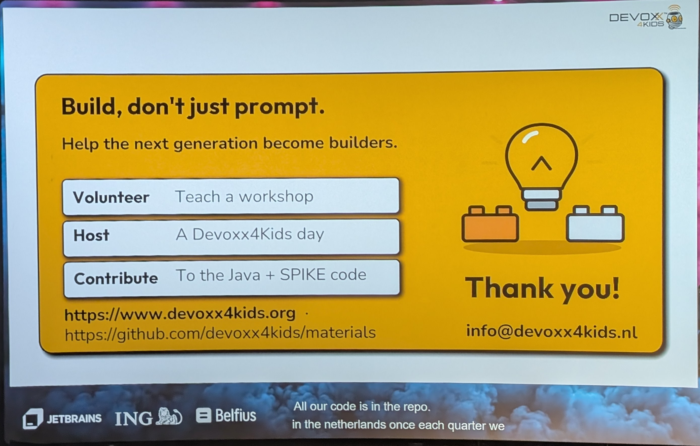

# 12:40 Java, LEGO & AI

[▶ Video](https://youtu.be/_VZg6dxlGaM)

[Java, LEGO & AI: Teaching the Next Generation to Build, Not Just Prompt](https://m.devoxx.com/events/dvbe26/talks/10045/java-lego-ai-teaching-the-next-generation-to-build-not-just-prompt) by [Eddy Vos](https://m.devoxx.com/events/dvbe26/speaker/10179/eddy-vos)
Room 6 · Lunch Talk · 12:40-13:20

## Summary

This session shows why teaching programming still matters in the AI era, using LEGO SPIKE robots in Java-based workshops for children. It covers technical methods to control SPIKE with Java, challenges encountered, educational lessons learned, and includes live robot demos.

## Timeline

### [23:45](https://youtu.be/_VZg6dxlGaM?t=1425)

## My take

