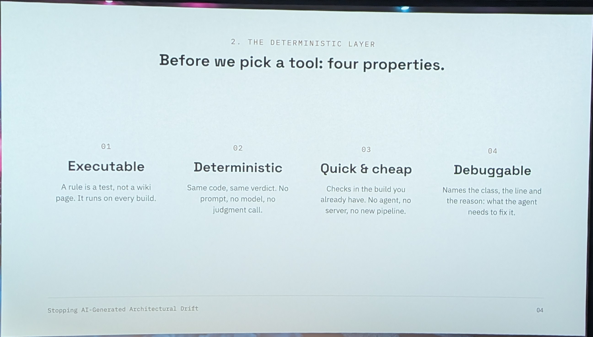
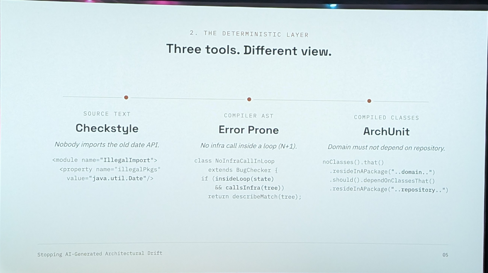

# 17:35 Mon 05

[▶ Video](https://youtu.be/K3kD89Y1YCk)


[Stopping AI-Generated Architectural Drift: Deterministic Guardrails for Agentic Coding](https://m.devoxx.com/events/dvbe26/talks/5507/stopping-ai-generated-architectural-drift-deterministic-guardrails-for-agentic-coding) by [Sasha Podlesniuk](https://m.devoxx.com/events/dvbe26/speaker/5807/sasha-podlesniuk)
Room 8 · Tools-in-Action · 17:35-18:05

## Summary

This talk explains how to prevent AI-generated code from spreading architectural violations by using layered guardrails. It shows why natural-language rules fail, and how deterministic enforcement with ArchUnit, custom linters, and CI gates can stop bad patterns immediately and make higher-level rules effective.

## Key points ⭐

- 03:41 error pron, java check like arch unit

## Timeline

### [02:29](https://youtu.be/K3kD89Y1YCk?t=149)


### [03:41](https://youtu.be/K3kD89Y1YCk?t=221) ⭐
- error pron
  - java check like arch unit



## Extra notes

https://www.youtube.com/@AriKuschnir


Les deux font de l'analyse statique de code Java, mais ils ne travaillent ni au même moment, ni au même niveau, ni sur le même type de problème. Ils sont complémentaires.

## ArchUnit : vérifier l'architecture

ArchUnit est une bibliothèque de tests. On écrit des règles d'architecture sous forme de tests JUnit, qui s'exécutent pendant la phase de test. Elle analyse le bytecode compilé (les `.class`) et construit un graphe de toutes les classes et de leurs dépendances. Elle a donc une vision globale de la codebase : qui dépend de qui, quels packages s'appellent entre eux, quelles annotations sont où.

Les questions typiques sont structurelles :

- « La couche service ne doit jamais appeler la couche web. »
- « Pas de cycles entre packages. »
- « Les classes annotées `@Stateless` doivent se trouver dans `..ejb..`. »
- « Personne n'utilise `java.util.Date` en dehors du module legacy. »

```java
@ArchTest
static final ArchRule services_ne_dependent_pas_du_web =
    noClasses().that().resideInAPackage("..service..")
        .should().dependOnClassesThat().resideInAPackage("..web..");
```

Un atout important pour un monolithe : le `FreezingArchRule`. Il enregistre les violations existantes comme une baseline et ne fait échouer le build que sur les nouvelles. On peut ainsi imposer une règle sur du legacy sans devoir tout corriger d'abord.

## Error Prone : détecter des bugs dans le code

Error Prone, développé par Google, est un plugin du compilateur `javac`. Il s'exécute pendant la compilation et analyse l'AST (l'arbre syntaxique) de chaque fichier source. Sa vision est locale et fine : il regarde les expressions, les appels de méthode et les types précis, mais fichier par fichier, sans vue d'ensemble de l'architecture.

Les questions typiques portent sur des erreurs de programmation :

- `String.format` avec un nombre d'arguments qui ne colle pas au pattern ;
- valeur de retour ignorée (`str.trim();` tout seul) ;
- `equals` entre types incompatibles ;
- `switch` non exhaustif, mauvais usage d'`Optional`, problèmes de concurrence, etc.

```java
String s = "abc";
s.replace("a", "b"); // Error Prone : ReturnValueIgnored → erreur de compilation
```

Il propose souvent un correctif automatique (patch) et sert de socle à d'autres outils, comme NullAway pour la nullabilité. Écrire ses propres vérifications avec l'API `BugChecker` est possible, mais nettement plus complexe qu'une règle ArchUnit.

## En résumé

||ArchUnit|Error Prone|
|---|---|---|
|Nature|Bibliothèque de tests|Plugin du compilateur javac|
|Quand|Phase de test|Compilation|
|Analyse|Bytecode, graphe global|AST source, local par fichier|
|Cible|Règles d'architecture et conventions|Bugs et mauvais patterns de code|
|Règles custom|Faciles (DSL fluide en Java)|Possibles mais plus techniques|
|Legacy|Freeze / baseline natif|Désactivation par check ou suppression|

La règle simple : **ArchUnit répond à « est-ce que ce code est au bon endroit et respecte la structure voulue ? », Error Prone répond à « est-ce que ce code fait ce que le développeur croit ? »** Sur un monolithe Java EE, les deux ensemble couvrent bien le terrain.

Côté mise en place, ArchUnit est trivial à ajouter (une dépendance de test). Error Prone demande davantage de configuration du `maven-compiler-plugin`. Depuis le JDK 16, il faut aussi des flags `--add-exports` / `-J--add-opens`, et il faut vérifier la compatibilité entre la version d'Error Prone et celle du JDK.

## My take

