# 10:40 Coder , coach , catalyst

[Coder, Coach, Catalyst - using questions to make people grow](https://m.devoxx.com/events/dvbe26/talks/14457/coder-coach-catalyst-using-questions-to-make-people-grow) by [Martin Mazur](https://m.devoxx.com/events/dvbe26/speaker/14652/martin-mazur)
Room 5 · Conference · 10:40-11:30

## Summary

This talk teaches technologists basic coaching skills—listening, asking better questions, and using informal to formal coaching—to help others solve their own problems, foster growth, and reduce the burden of constantly taking on teammates' issues.

## Timeline

### 05:00
- Hivitory[?] tower , vilan trap
- you seen are the vilain

### 08:00
- Two problems

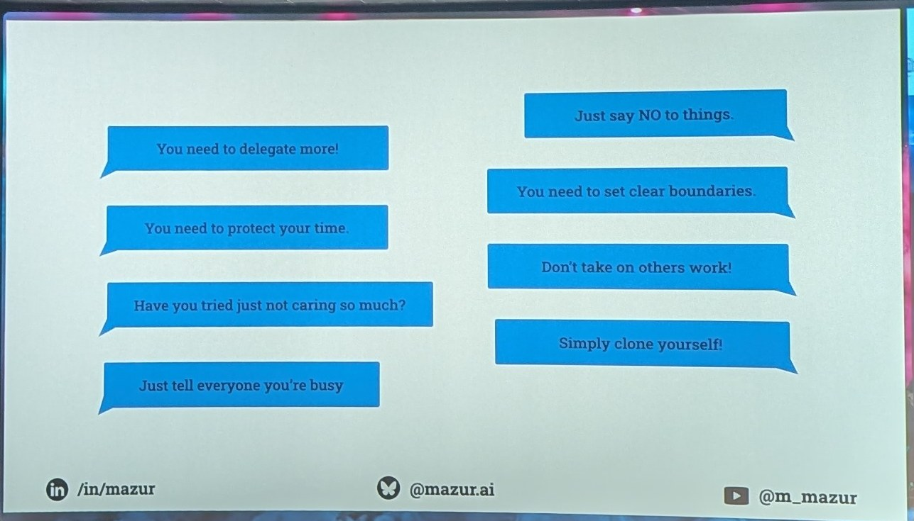

### 09:00
- Coachin technique

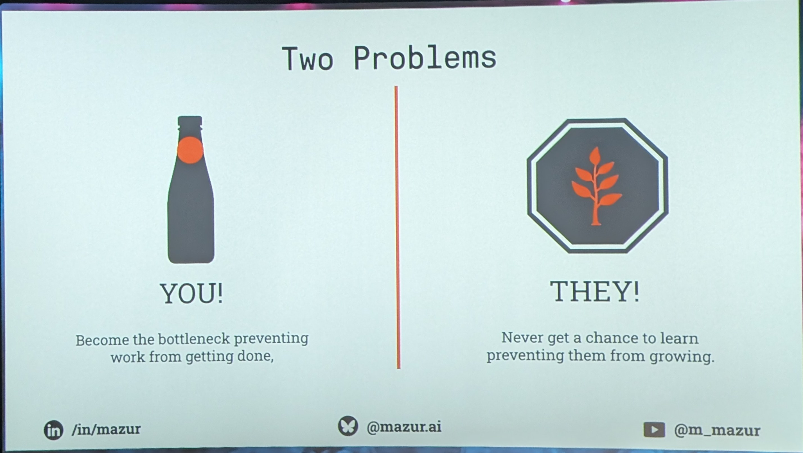

### 12:00
- active listening

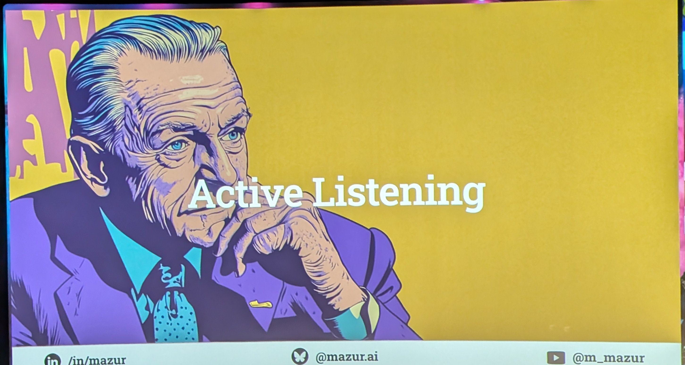

### 17:00
- Coaching For nat[?]
- Fomal coaching : is hard
- impromptu coaching   5 - 15 min
  - focus
  - eficient
  - Most use full
- team coaching : the Most Dificult

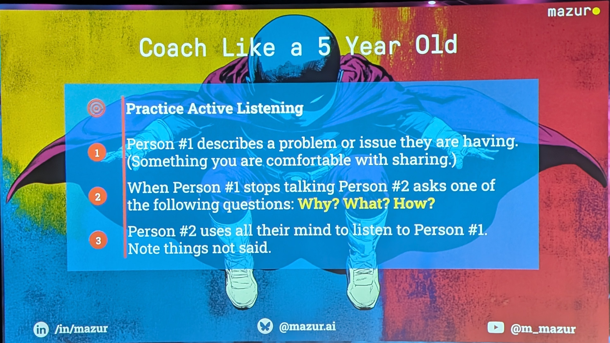

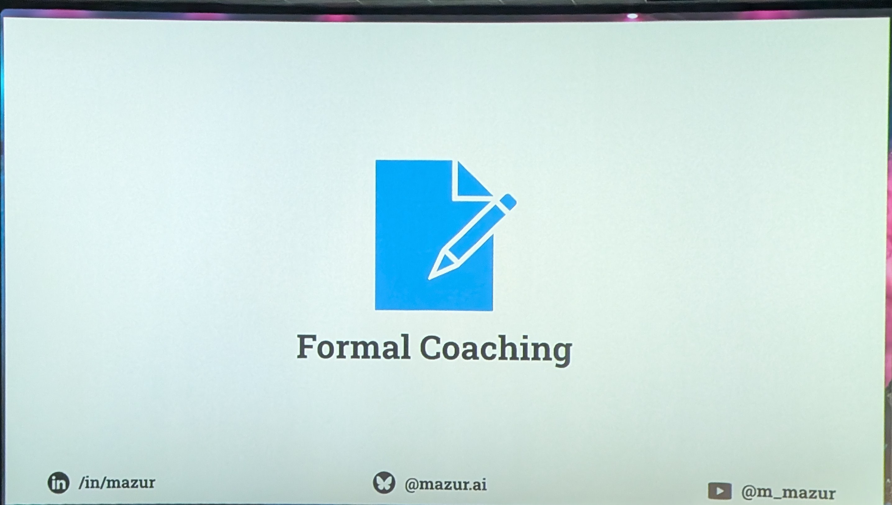

### 20:30

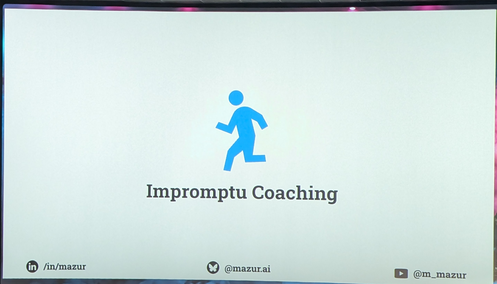

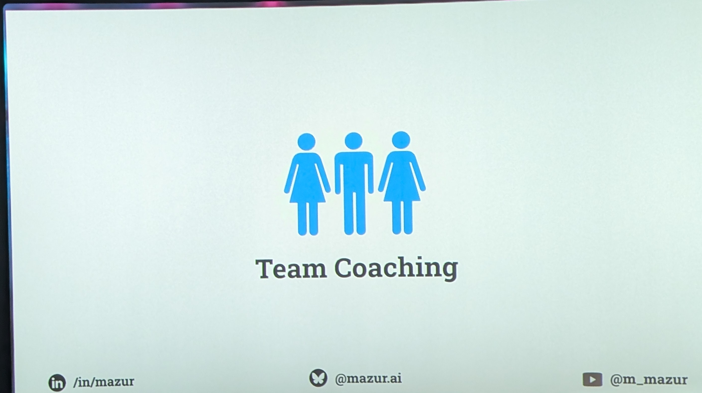

### 23:00
- Five type of question

### 25:00
- iniciation questions
  - not emotionally[?] question
  - No yes or no question
  -
  - No question prompt for problem
    - the will always try to find a problem

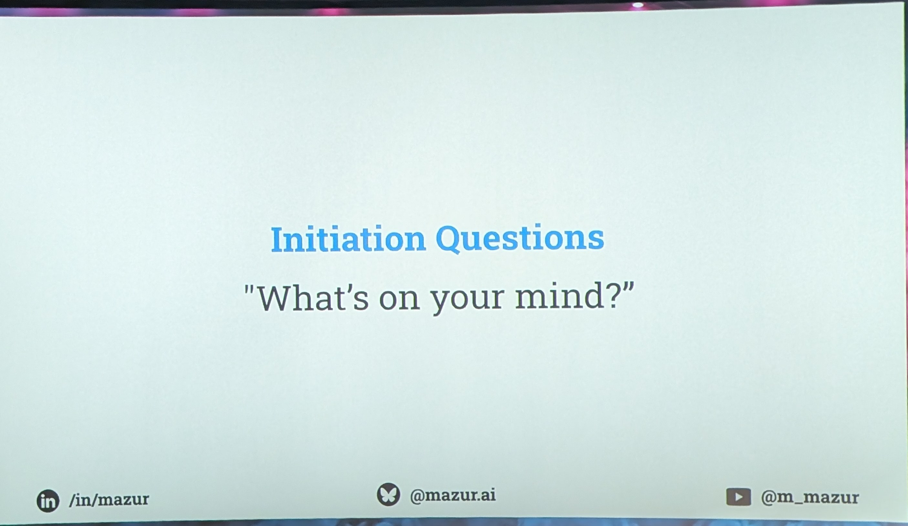

### 27:00
- ex cuvation[?] question
- " the First anser is never the root Couse "
- and wat else ?   But the Best is The silence

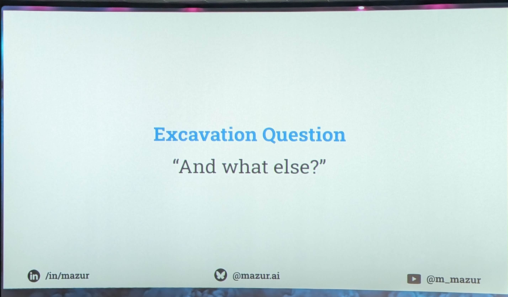

### 30:00
- Focus .Question
- Back to Him and nd[?] external Factor out of contrôle
- dont explain How you fix Problem   we dont Know What He try

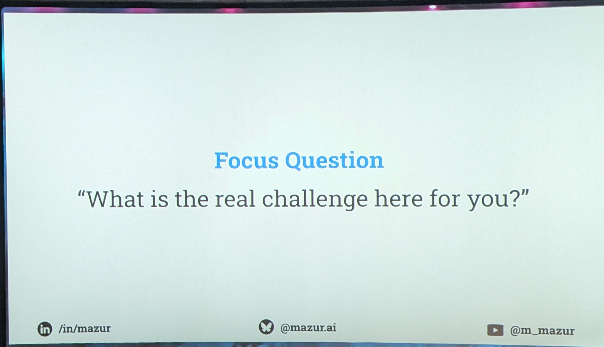

### 33:22

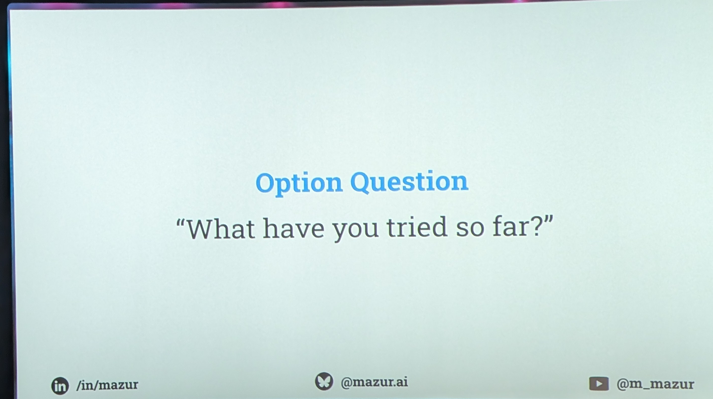

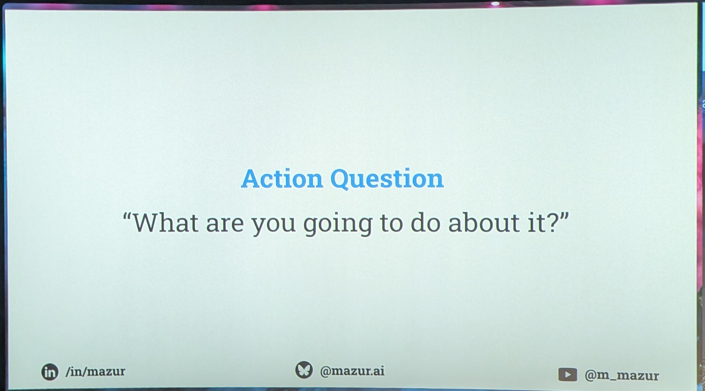

### 40:09

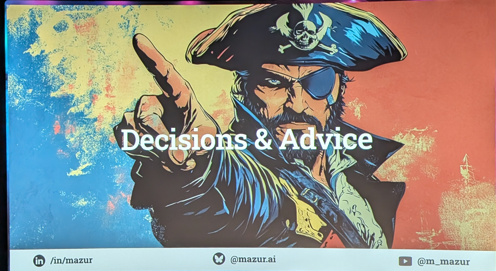

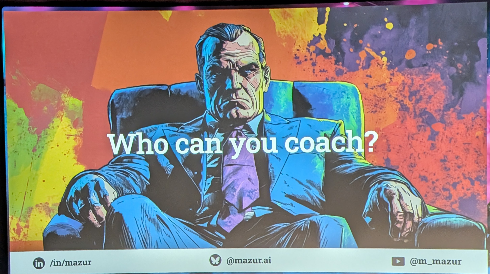

### 45:00
- Pit Fall

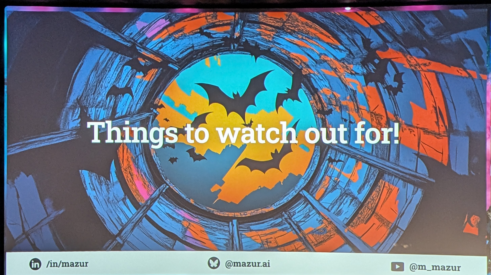

### 49:39

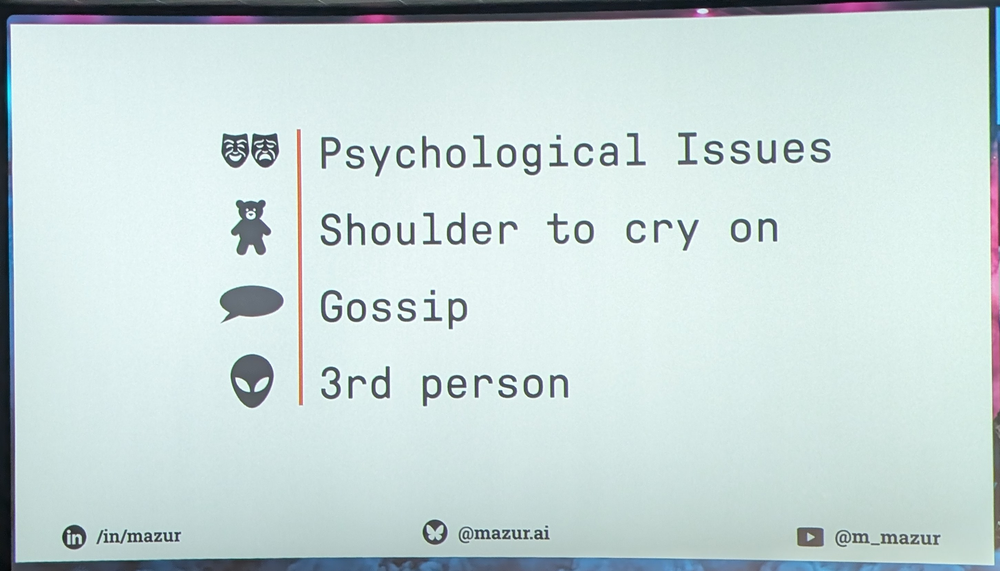

### 51:42

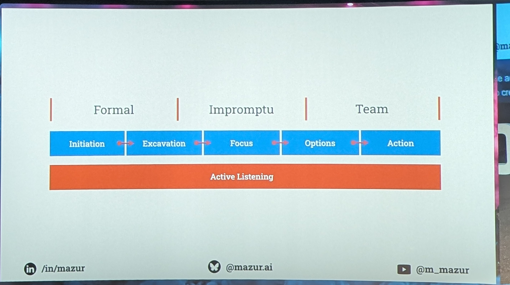

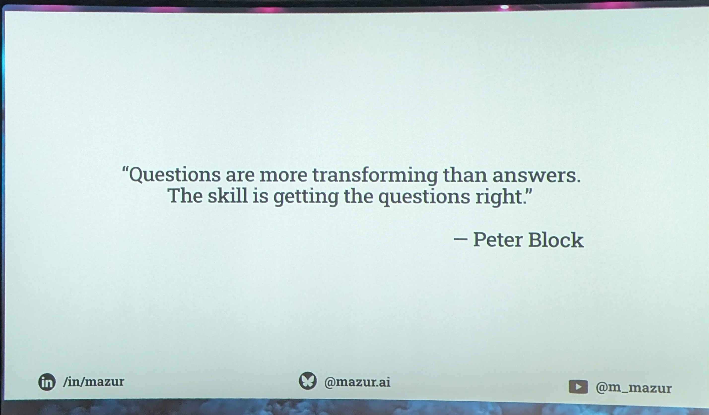

## My take

