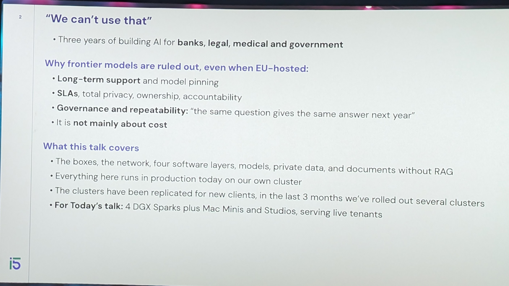
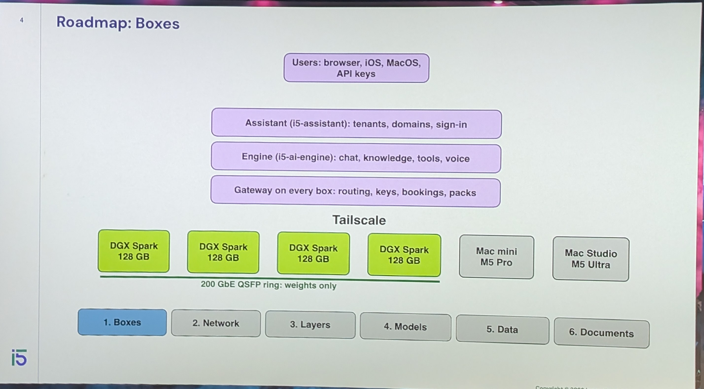
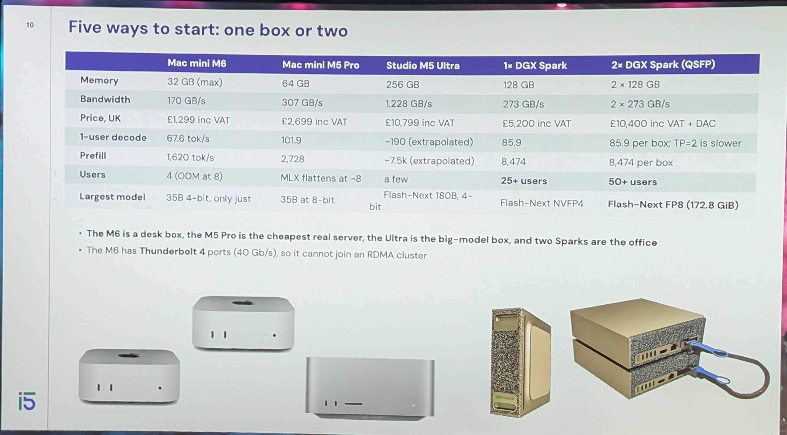
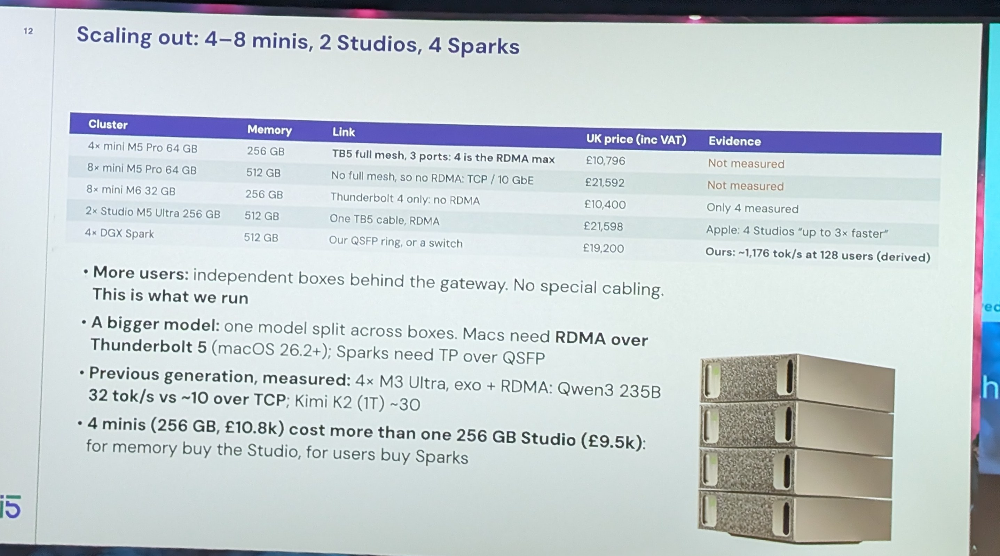
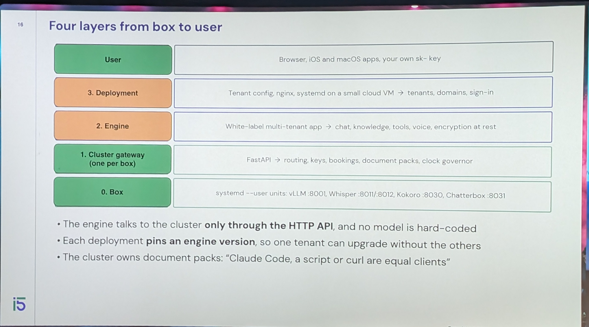
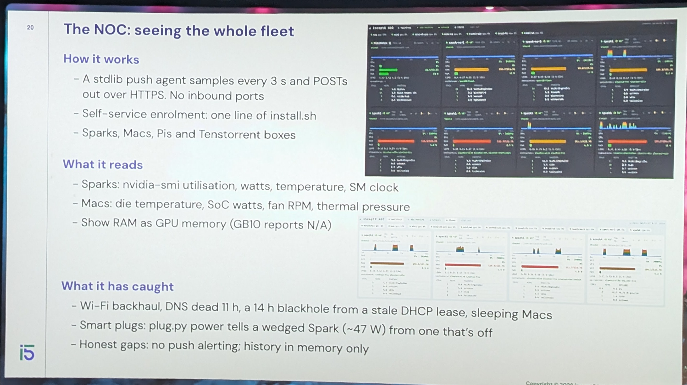
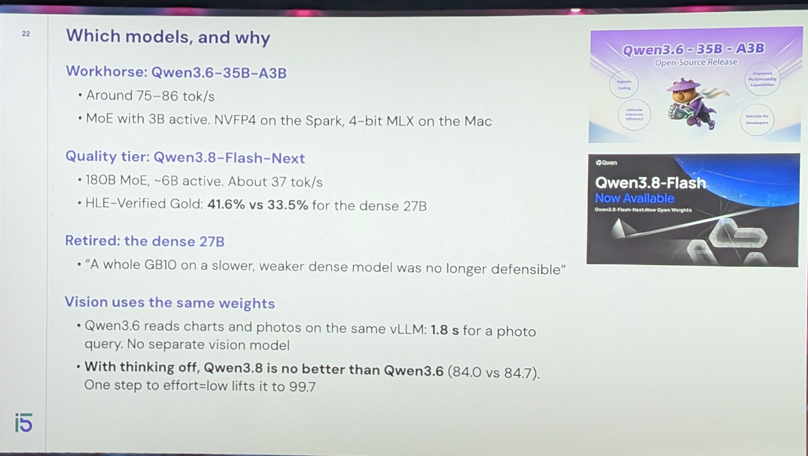
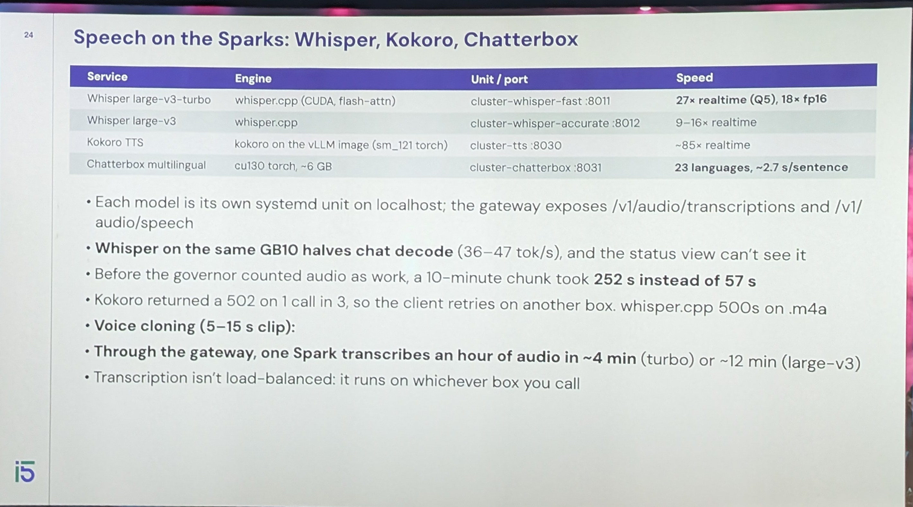
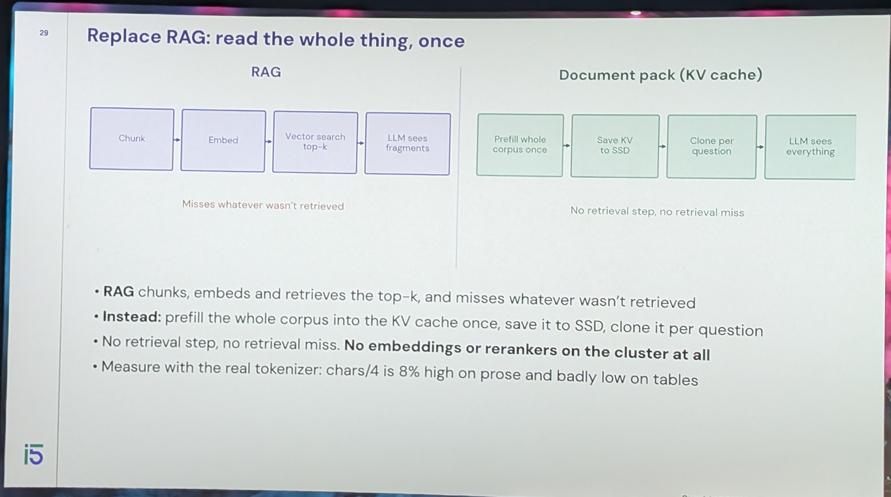
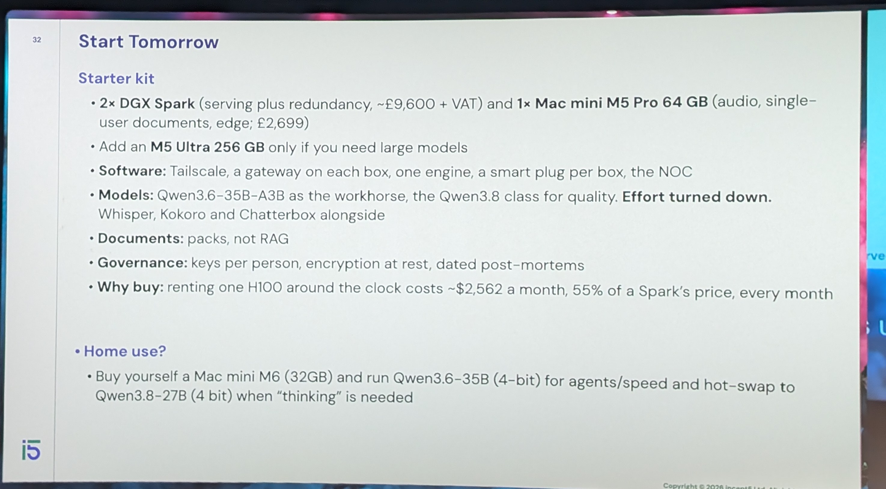

# 15:02 local private cloud

[Build a private cluster for the office](https://m.devoxx.com/events/dvbe26/talks/27453/build-a-private-cluster-for-the-office) by [John Davies](https://m.devoxx.com/events/dvbe26/speaker/27402/john-davies)
Room 6 · Conference · 15:00-15:50

## Summary

A technical talk on building private, local AI systems for regulated organizations using open-weight models. It covers hardware choices, networking, model selection, private data access, and fast document retrieval, helping small teams reduce dependence on frontier model providers while ensuring privacy, governance, and long-term support.

## Timeline

### 00:42

### 01:00
- Mac MiNi
- Spork

### 07:28

### 08:00
- if Model doesn't Fit on one Box
- it Con om e[?] , But still slower
- toilscale cable  Not Alaways usable

### 13:38

### 19:11

### 20:00
- Best Model
  - Still gwen

### 26:53

### 28:00
- RAG

### 36:00
- homies[?] agent  sae[?] claude code

### 39:00[?]
- Code readin ≠ code writing

## My take

