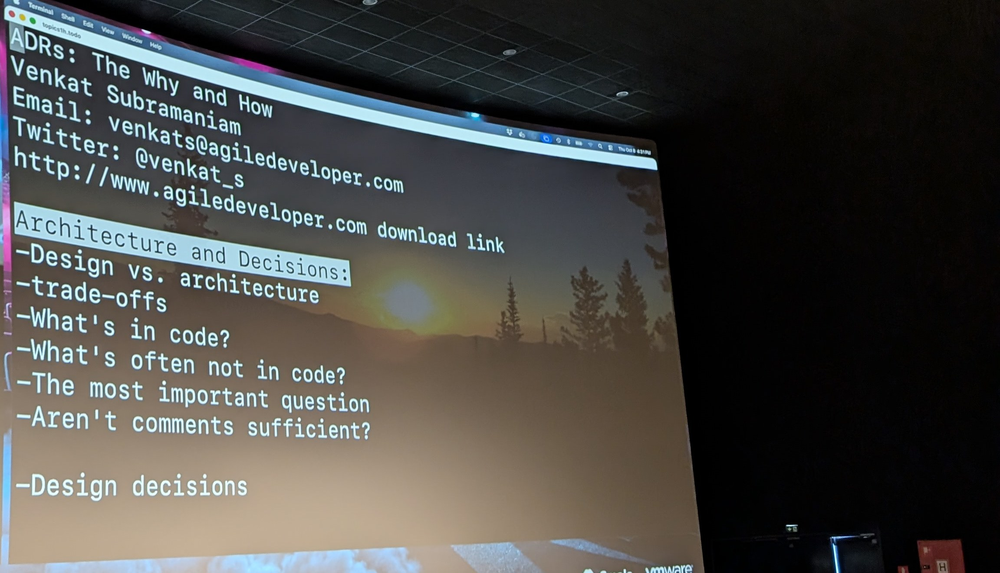
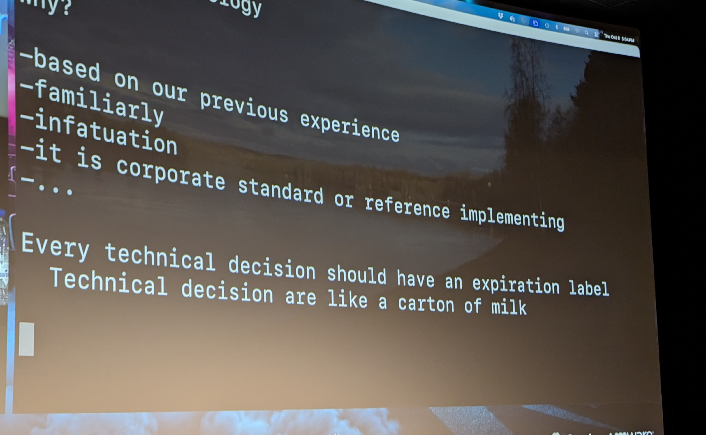
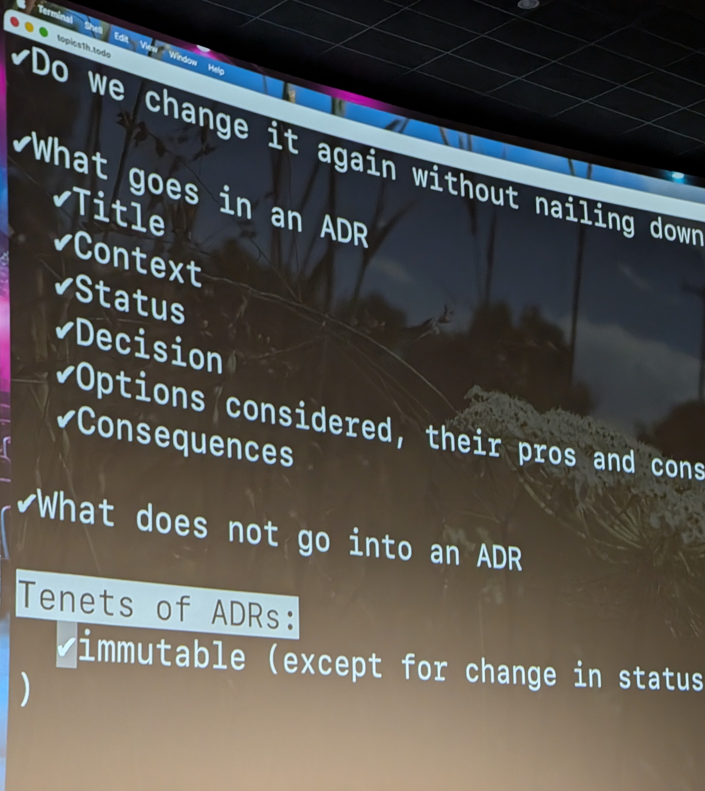

# 16:30 venkat

[ADRs: The Why and How](https://m.devoxx.com/events/dvbe26/talks/49256/adrs-the-why-and-how) by [Venkat Subramaniam](https://m.devoxx.com/events/dvbe26/speaker/49109/venkat-subramaniam)
Room 8 · Conference · 16:30-17:20

## Summary

This presentation explains Architectural Decision Records (ADRs), showing how to create and maintain them and why they matter. It highlights their role in documenting decisions, capturing the reasons behind them, and helping teams reassess choices as business needs or technologies change.

## Timeline

### 01:00
- What is a real architect
- i'm the one who take the bad new From the management

### 04:00
- what is architecture
- => For him : Architecture is a set oF Decision that have high impact

### 06:00
- Design <- - - - - - - > architecture
- x ML parser (lib) - Design Decision

### 08:00
- Nice analogie with hand an Botle
- Progming language   Archi Decision
- lib = rent a house
- framework = Buy a house

### 11:00
- Reversability

### 12:00
- trade oFF

### 14:00
- reosoning is not in the code

### 15:00
- Kind of person (what, How, when, Why)

### 23:00
- Documentation

### 30:00
- Why you took this Decission
- ADR force you to Write it

### 34:53

### 37:00
- story time about wire

### 40:00
- No decession without alternative evaluation

### 46:04

## My take

