# 18:55 Closing Keynote

[F*ck The System, and other bad ideas for the future](https://m.devoxx.com/events/dvbe26/talks/49751/f-ck-the-system-and-other-bad-ideas-for-the-future) by [Jo Caudron](https://m.devoxx.com/events/dvbe26/speaker/49701/jo-caudron)
Room 5 · Closing Keynote · 18:55-19:40

## Summary

A provocative manifesto exploring today's geopolitical upheaval and asking how Europe can become sovereign, resilient, and innovative in the emerging world order. It challenges old assumptions, reimagines the future, and appeals to citizens, entrepreneurs, policymakers, and thinkers seeking a stronger Europe.

## Timeline

### 02:01

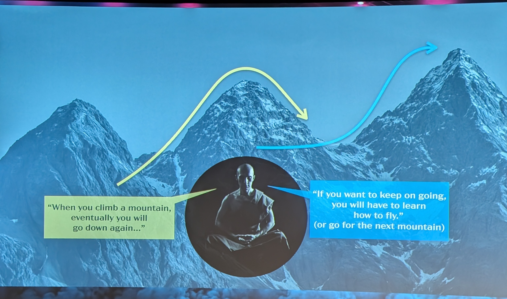

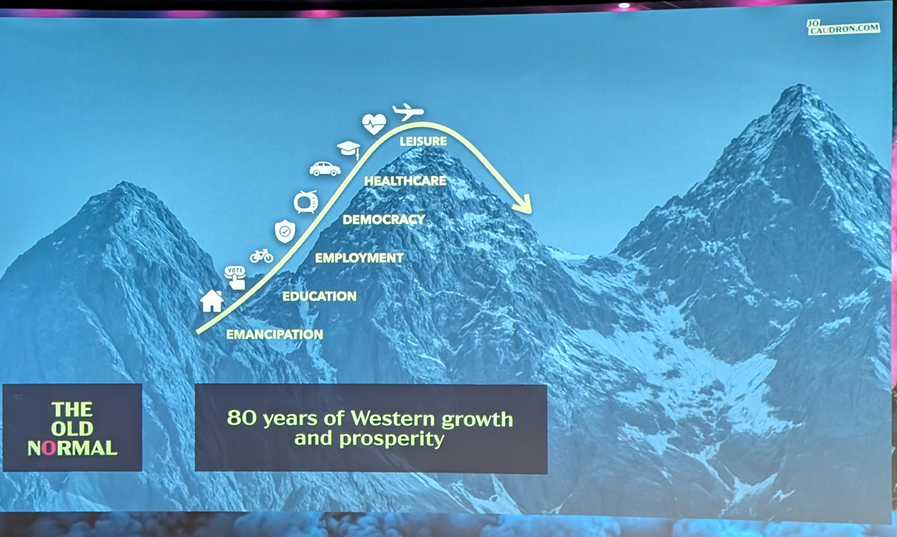

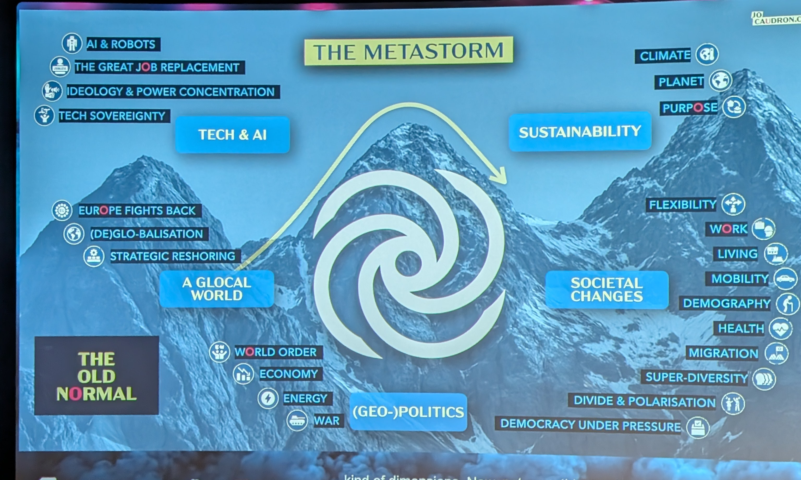

### 06:40

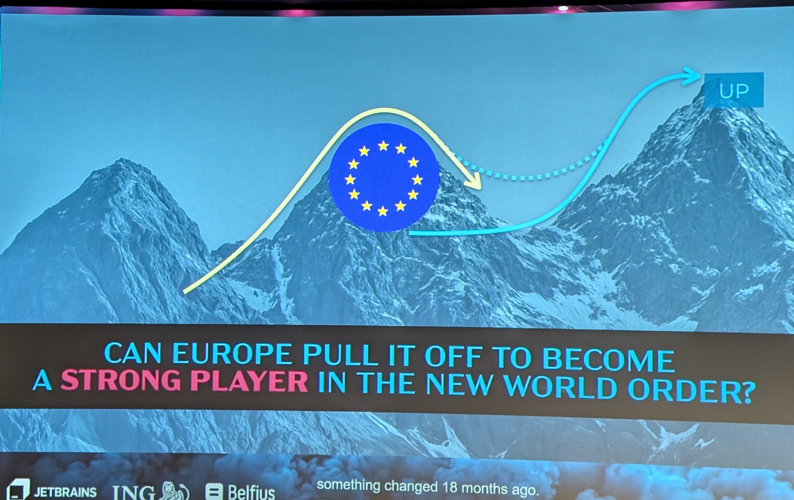

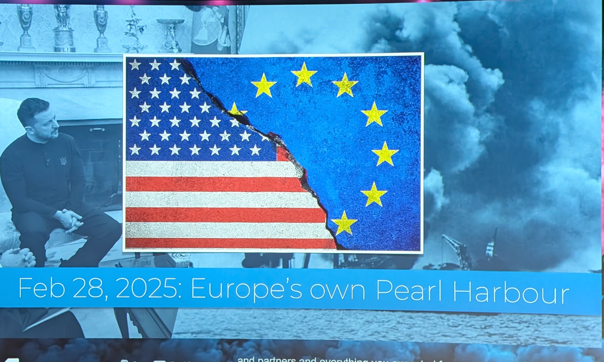

### 10:10

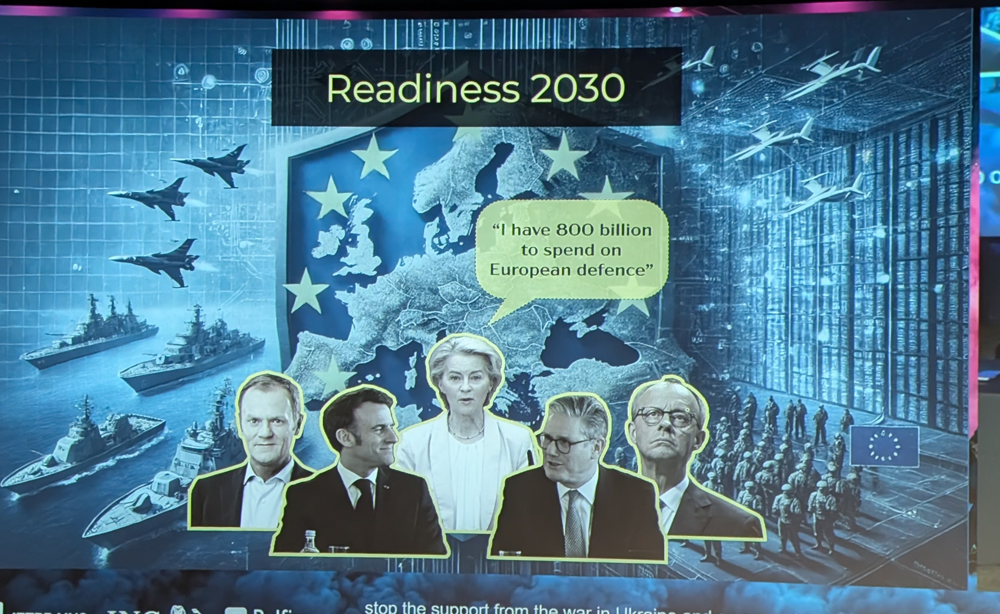

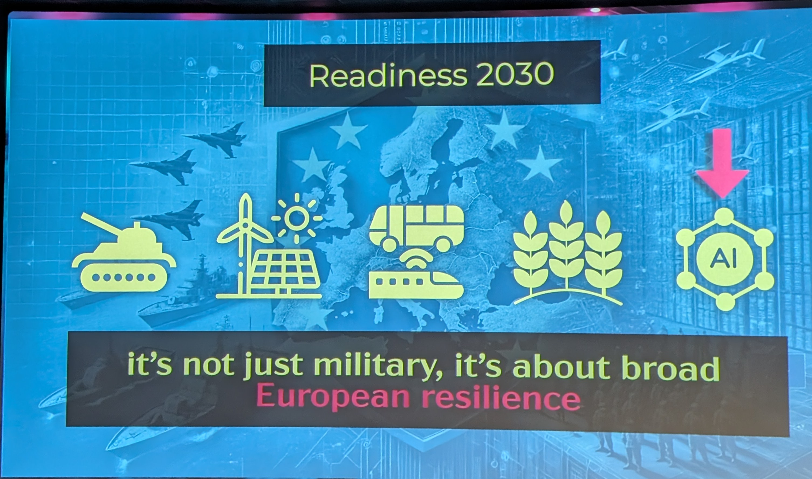

### 16:03

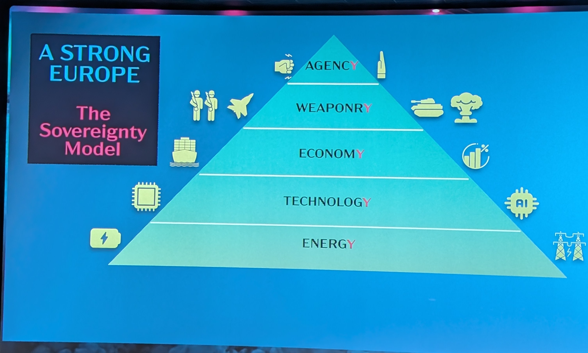

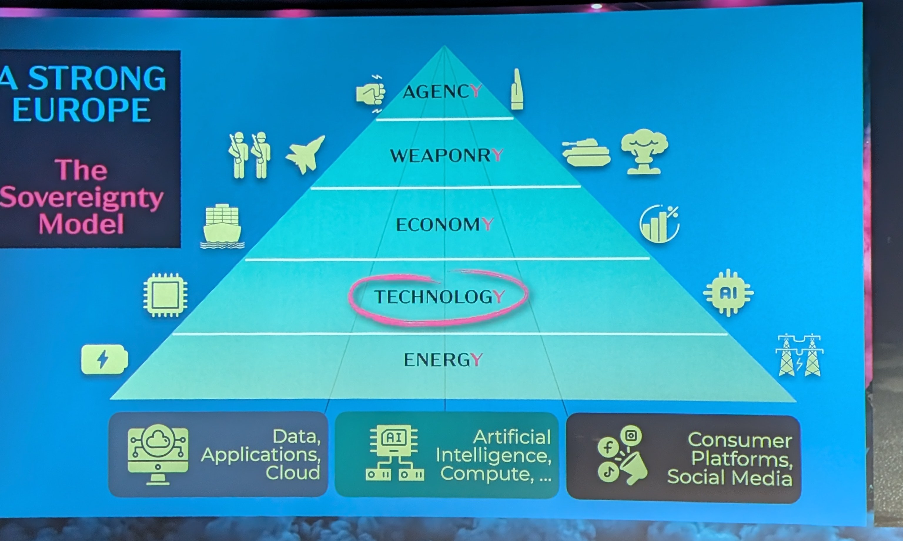

### 25:12

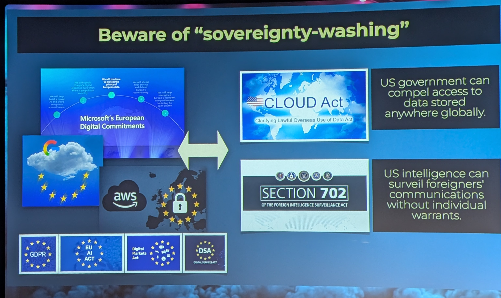

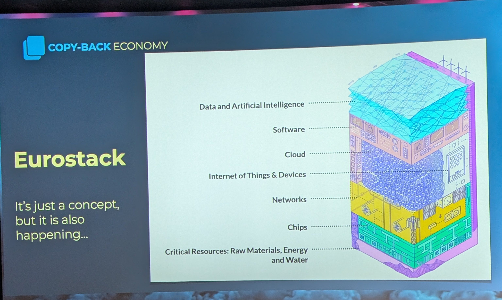

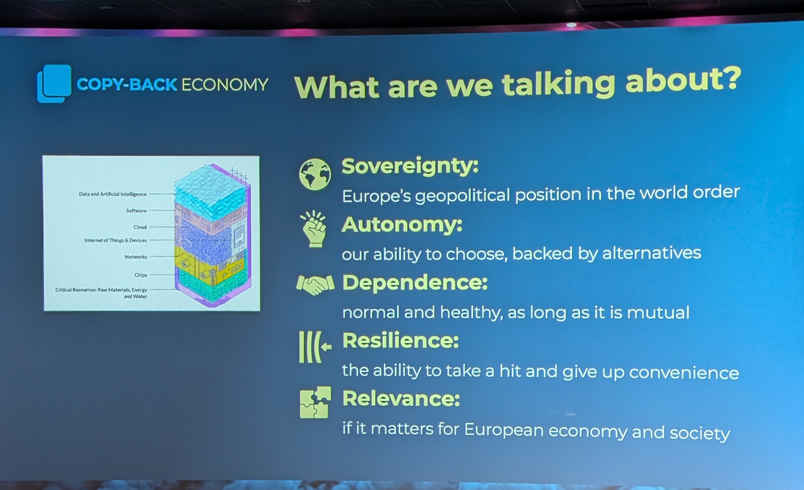

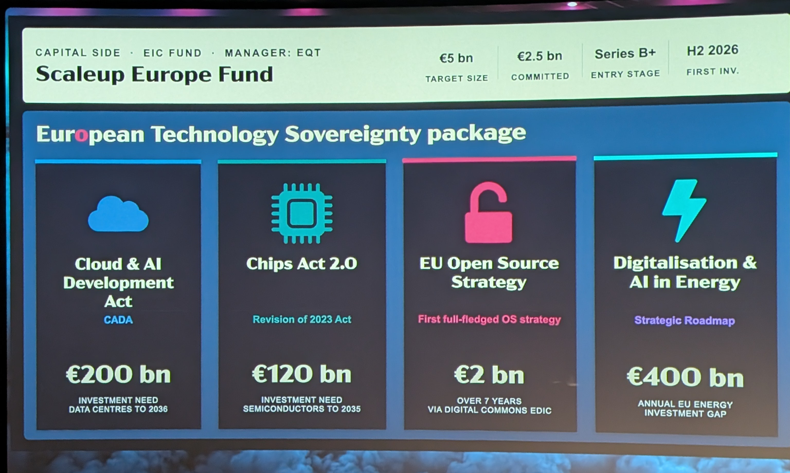

### 30:17

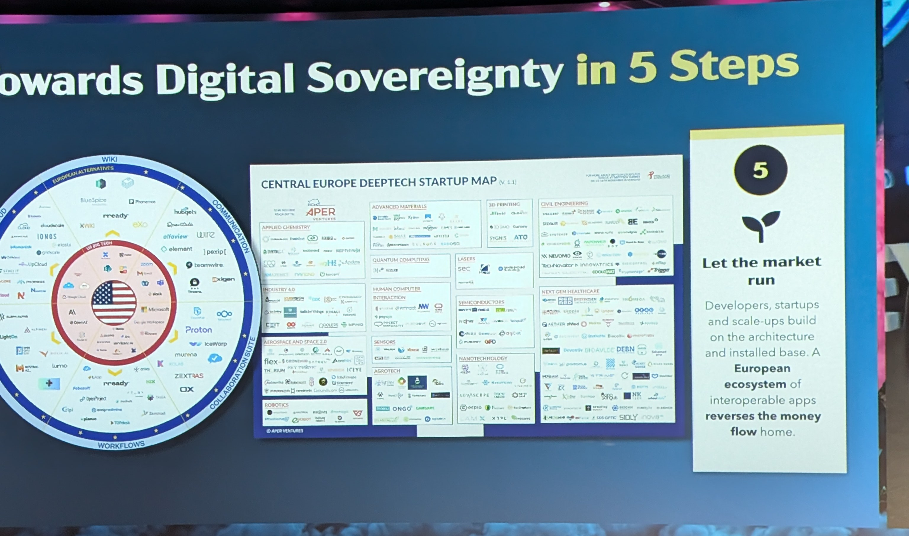

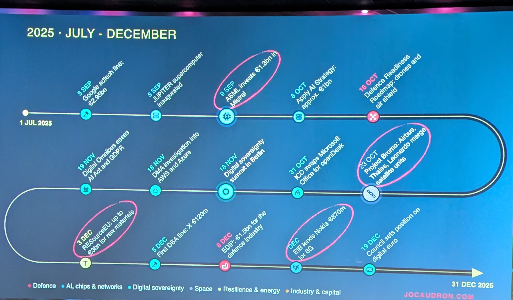

### 38:53

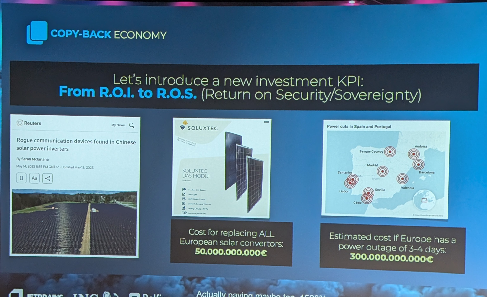

### 51:27

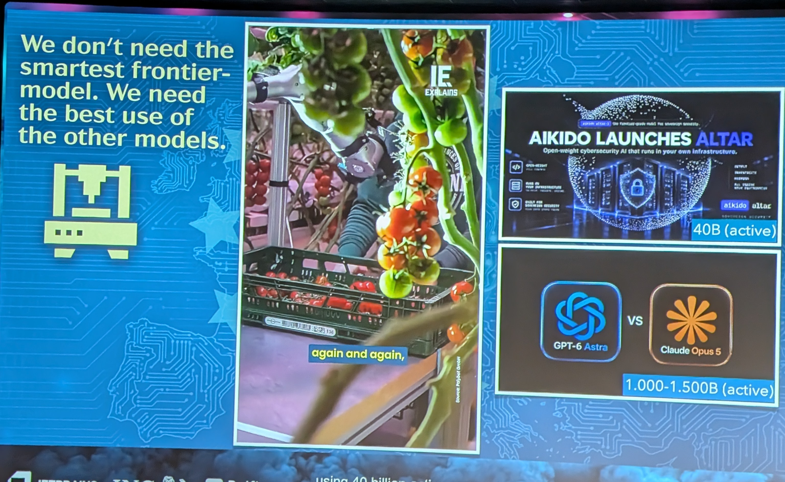

## My take

