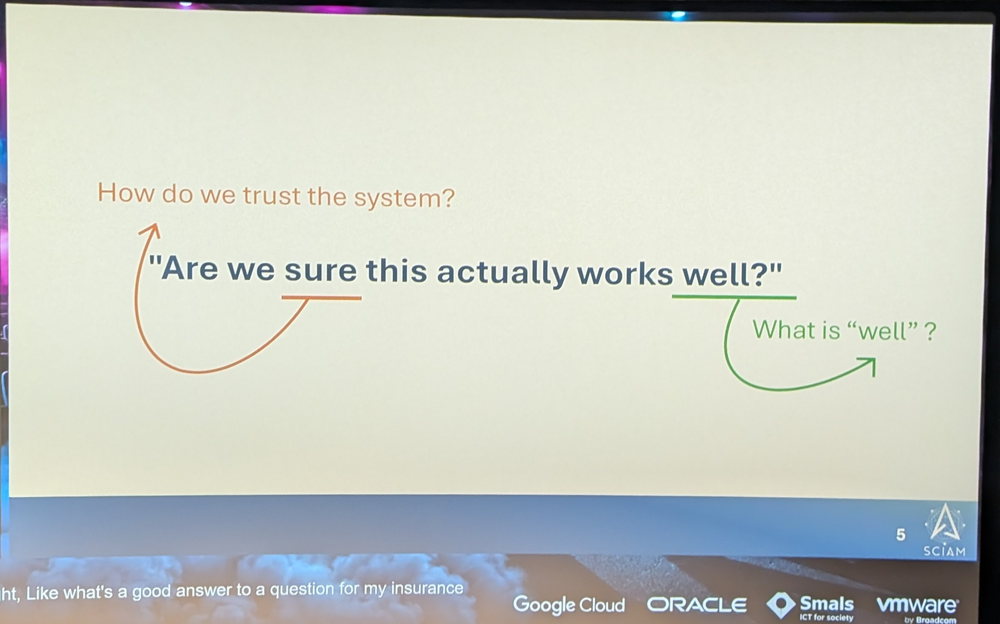
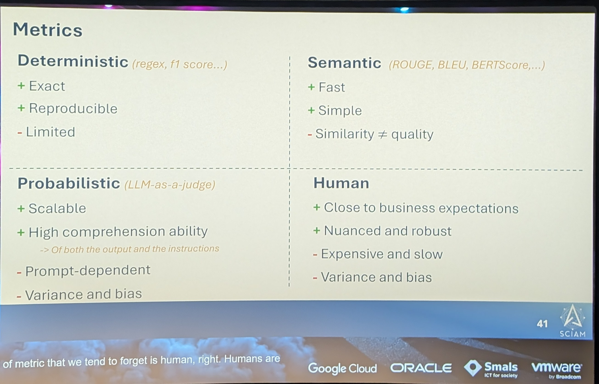
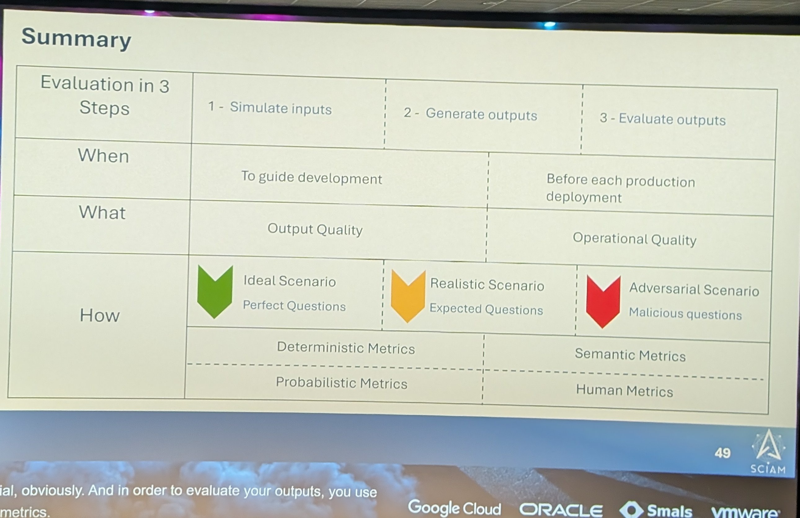
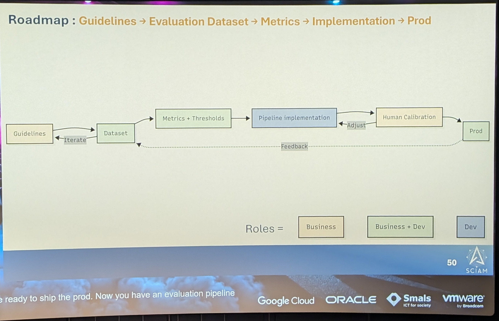

# 12:40 Measuring the Unmeasurable

[▶ Video](https://youtu.be/Qdn-I3q50Ww)

[Measuring the Unmeasurable: Evaluating Generative AI in Practice](https://m.devoxx.com/events/dvbe26/talks/10016/measuring-the-unmeasurable-evaluating-generative-ai-in-practice) by [Erin Pacquetet](https://m.devoxx.com/events/dvbe26/speaker/8657/erin-pacquetet)
Room 8 · Lunch Talk · 12:40-13:20

## Summary

This session explores how to evaluate generative AI systems reliably despite their unpredictability. Using a RAG chatbot case study, it covers adapting metrics for accuracy, coherence, and business value; the limits of traditional and LLM-as-a-judge methods; the role of human review; and continuous monitoring for drift.

## Timeline

### [05:10](https://youtu.be/Qdn-I3q50Ww?t=310)

### [29:06](https://youtu.be/Qdn-I3q50Ww?t=1746)

### [37:40](https://youtu.be/Qdn-I3q50Ww?t=2260)

### [40:40](https://youtu.be/Qdn-I3q50Ww?t=2440)

## Extra notes
- Room 8 · Lunch Talk · 81 favoris
- Comment évaluer une IA générative : métriques, limites du LLM-as-a-judge, rôle de la revue humaine. Utile pour la question récurrente d'un AI lead : comment mesurer ce que l'IA apporte.

## My take

