# 13:30 Victor

[▶ Video](https://youtu.be/C10mZ3pCnGo)

[Responsibly Dimming the Lights in the Software Factory](https://m.devoxx.com/events/dvbe26/talks/31452/responsibly-dimming-the-lights-in-the-software-factory) by [Victor Rentea](https://m.devoxx.com/events/dvbe26/speaker/30506/victor-rentea)
Room 8 · Deep Dive · 13:30-16:30

## Summary

This talk shares how agentified engineering teams optimize code review for AI-generated code while avoiding cognitive debt and skill erosion. It outlines practical steps and milestones to progressively improve code quality, then safely reduce review intensity as confidence grows, gradually “dimming the lights” area by area.

## Key points ⭐

- 1:03:00 learn abou calitim [?]
- 1:09:00 Claude Scan his gitHub to see his tools he used on claude code
- 1:49:00 invest on pluging market or SFPD cLI
- 2:40:00 Refactoring, every post is important
- 2:40:00 QA, Same as Refatoring

## Timeline

### [04:00](https://youtu.be/C10mZ3pCnGo?t=240)
- Dark Factory

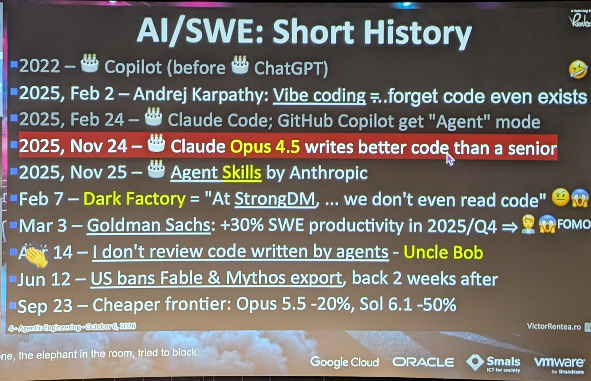

### [16:00](https://youtu.be/C10mZ3pCnGo?t=960)
- Requirement   grill the Business

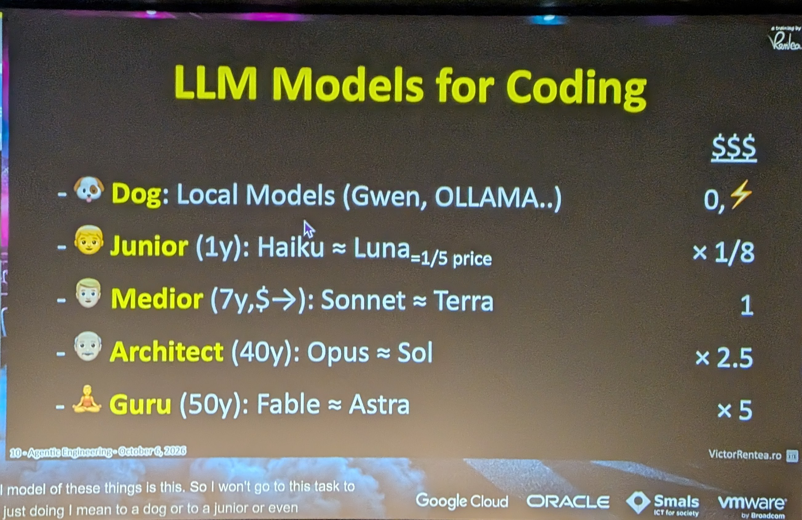

### [19:00](https://youtu.be/C10mZ3pCnGo?t=1140)
- Skill = opignion

### [20:00](https://youtu.be/C10mZ3pCnGo?t=1200)
- grill-me   skill
  - Reply to question and Ask Agent to add information on the project.
  - create new Discussion and Ask to teach , prototype , explain
  - AGent is a child you want to Be a good parenting
  - teach our Kids on improve there memory

### [23:36](https://youtu.be/C10mZ3pCnGo?t=1416)
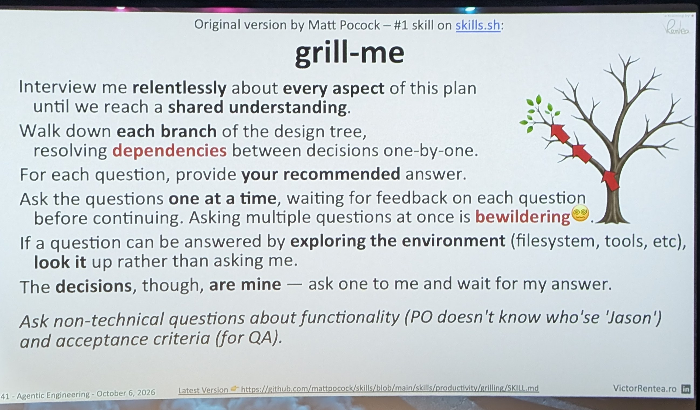

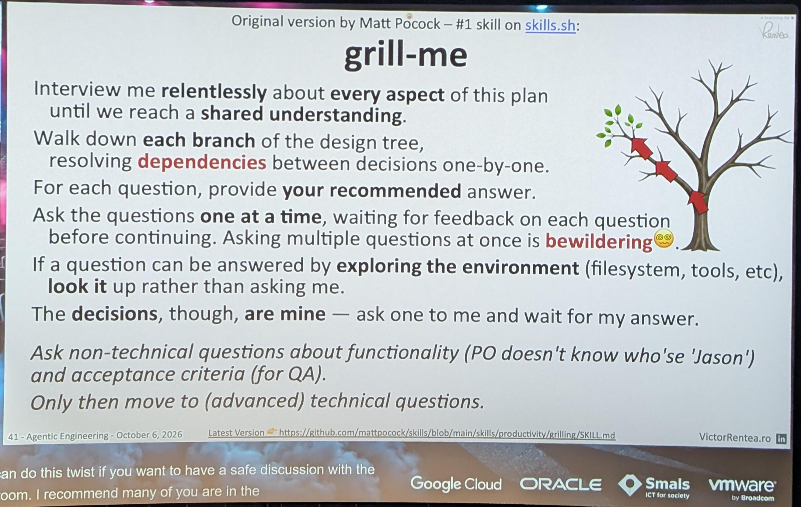

### [35:29](https://youtu.be/C10mZ3pCnGo?t=2129)
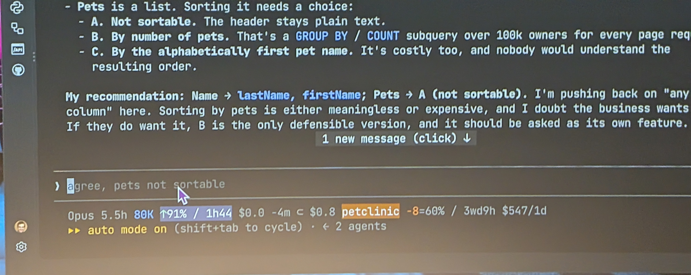

### [36:00](https://youtu.be/C10mZ3pCnGo?t=2160)
- DB cli
- => dont need Mcp
  - -> Debatable
- For Agent
  - -> Knowledge
  - -> give tools
- you go to Architect with question Not solution

### [43:08](https://youtu.be/C10mZ3pCnGo?t=2588)
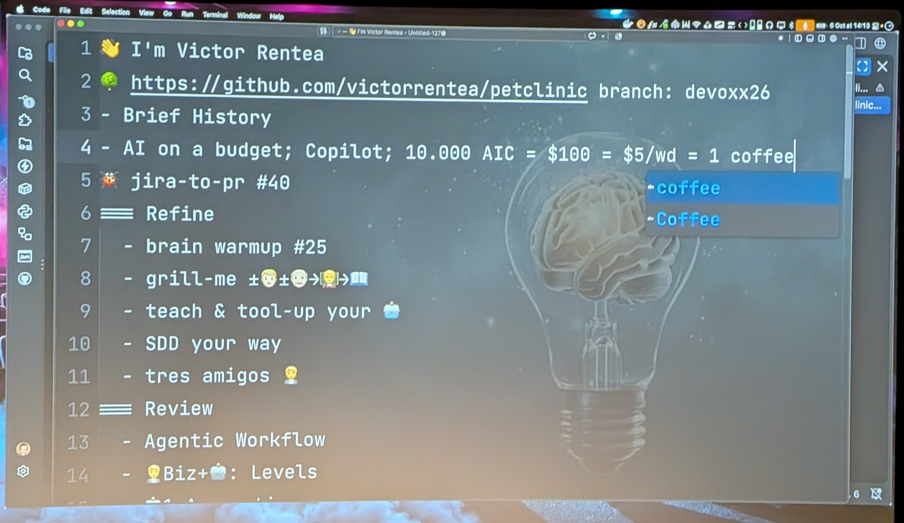

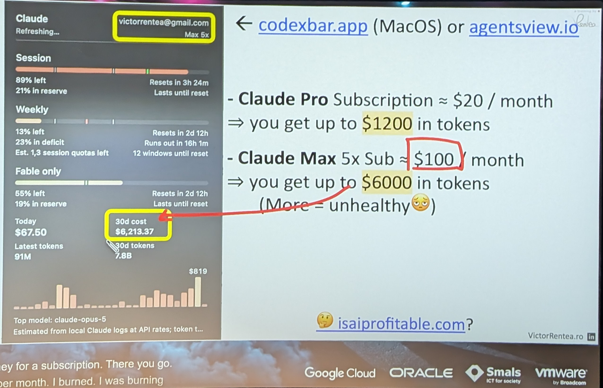

### [46:18](https://youtu.be/C10mZ3pCnGo?t=2778)
- take a frameWork SDD on Change the framework for our own ned workflow
- IT doesn't need Followers Need leader to use AI

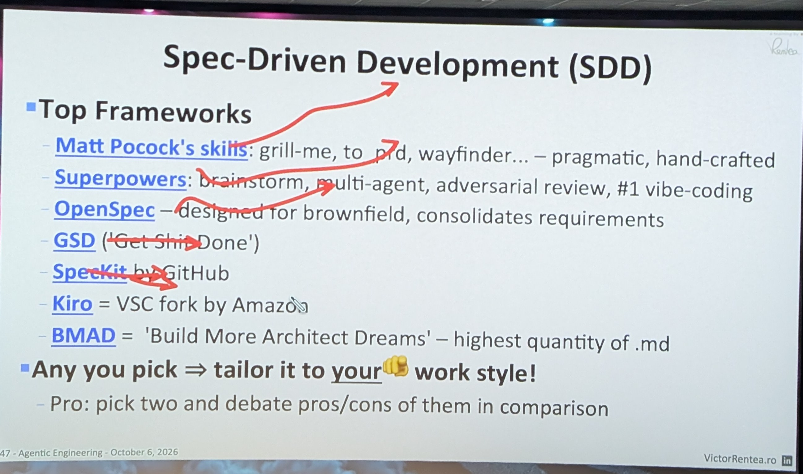

### [49:00](https://youtu.be/C10mZ3pCnGo?t=2940)
- sleep on a problem

### [50:00](https://youtu.be/C10mZ3pCnGo?t=3000)
- Remote work is Dead ?

### [53:00](https://youtu.be/C10mZ3pCnGo?t=3180)
- spec for him is not good
  - -> Remove 3 month later
  - -> will Be not Aligned with Code
- warm the Brain Before session meeting

### [1:03:00](https://youtu.be/C10mZ3pCnGo?t=3780) ⭐
- learn abou calitim [?]

### [1:04:00](https://youtu.be/C10mZ3pCnGo?t=3840)
- teach me skill

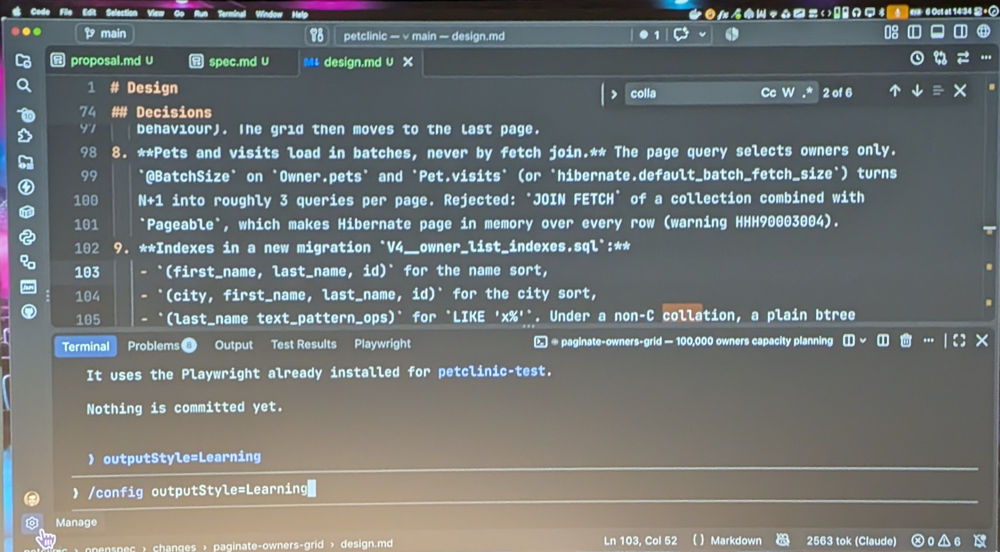

### [1:05:00](https://youtu.be/C10mZ3pCnGo?t=3900)
- Vibe : we vibe our tool
  - change the tool we used for on own ned
- Build : For production

### [1:09:00](https://youtu.be/C10mZ3pCnGo?t=4140) ⭐
- Claude Scan his gitHub to see his tools he used on claude code

### [1:15:00](https://youtu.be/C10mZ3pCnGo?t=4500)
- wa-cli (What's App cli)
- if Mcp => doesn't exist make a cli
- Read teams Web

### [1:36:00](https://youtu.be/C10mZ3pCnGo?t=5760)
- skill to Follow the Gh action

### [1:38:00](https://youtu.be/C10mZ3pCnGo?t=5880)
- Browse his GitHub to see the set up

### [1:39:00](https://youtu.be/C10mZ3pCnGo?t=5940)
- he has a statemet to use Big models

### [1:45:00](https://youtu.be/C10mZ3pCnGo?t=6300)
- LGTM look GOOD To me
  - -> Fatigue
  - -> Approuve without look

### [1:47:00](https://youtu.be/C10mZ3pCnGo?t=6420)
- Not All change need the same Process

### [1:49:00](https://youtu.be/C10mZ3pCnGo?t=6540) ⭐
- invest on pluging market or SFPD cLI

### [1:51:00](https://youtu.be/C10mZ3pCnGo?t=6660)
- Review Not Review AI
  - if not another AI Review it First

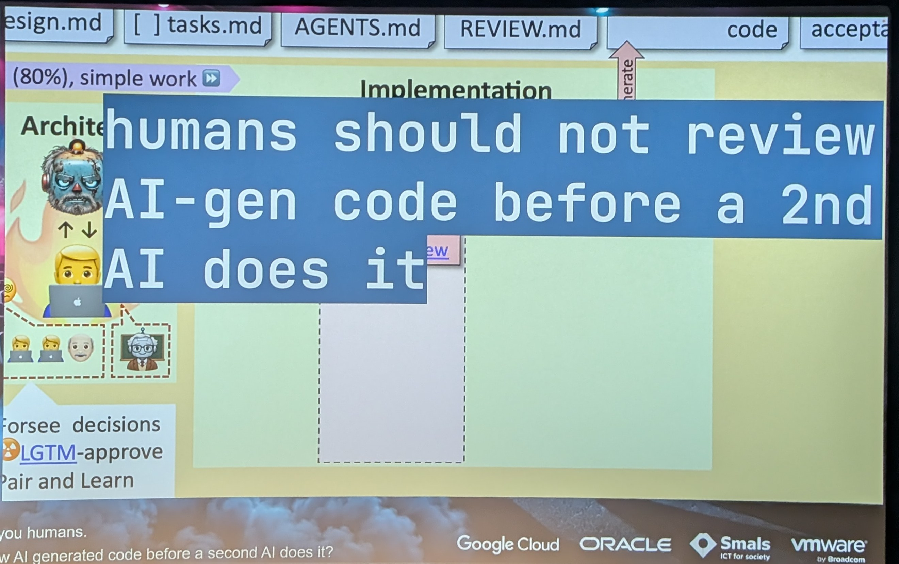

### [1:55:47](https://youtu.be/C10mZ3pCnGo?t=6947)
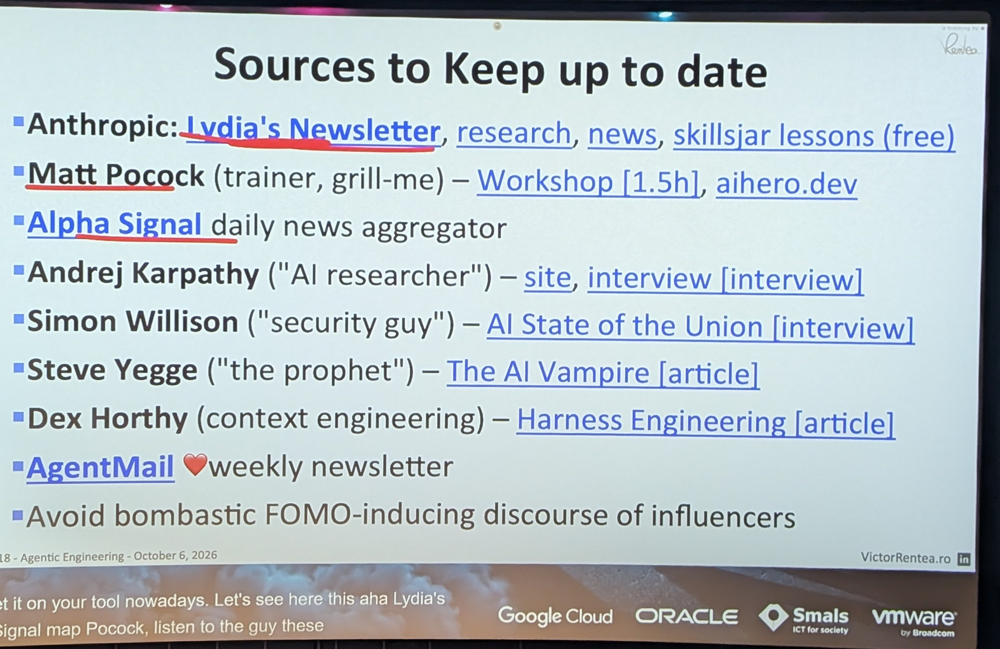

### [1:59:00](https://youtu.be/C10mZ3pCnGo?t=7140)
- harness Hook
  - -> post Hook
    - to force Harness to continue

### [2:00:00](https://youtu.be/C10mZ3pCnGo?t=7200)
- Demo of his tools to get FeedBack and Modified

### [2:12:00](https://youtu.be/C10mZ3pCnGo?t=7920)
- optimizye CI

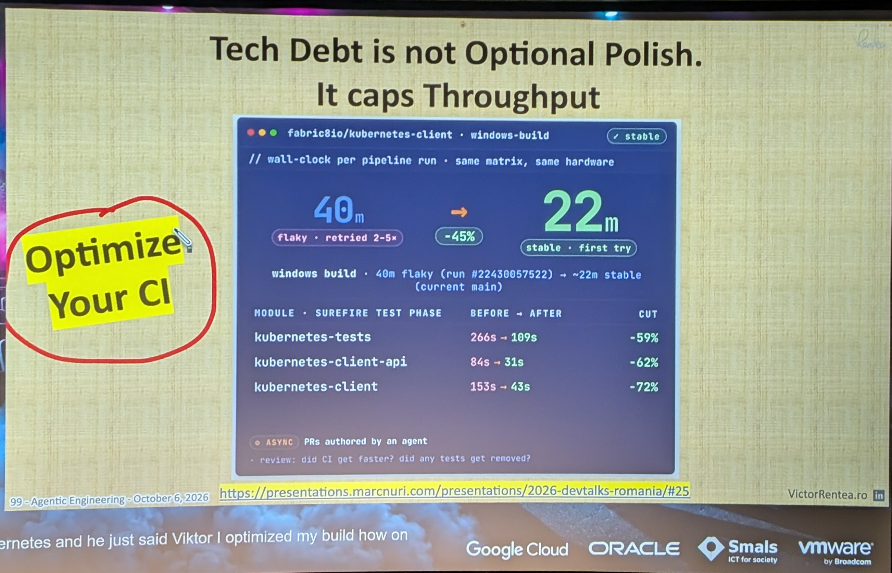

### [2:15:00](https://youtu.be/C10mZ3pCnGo?t=8100)
- Brain Focus time

### [2:20:00](https://youtu.be/C10mZ3pCnGo?t=8400)
- Review . md
  - -> like claude MD for Review

### [2:27:21](https://youtu.be/C10mZ3pCnGo?t=8841)
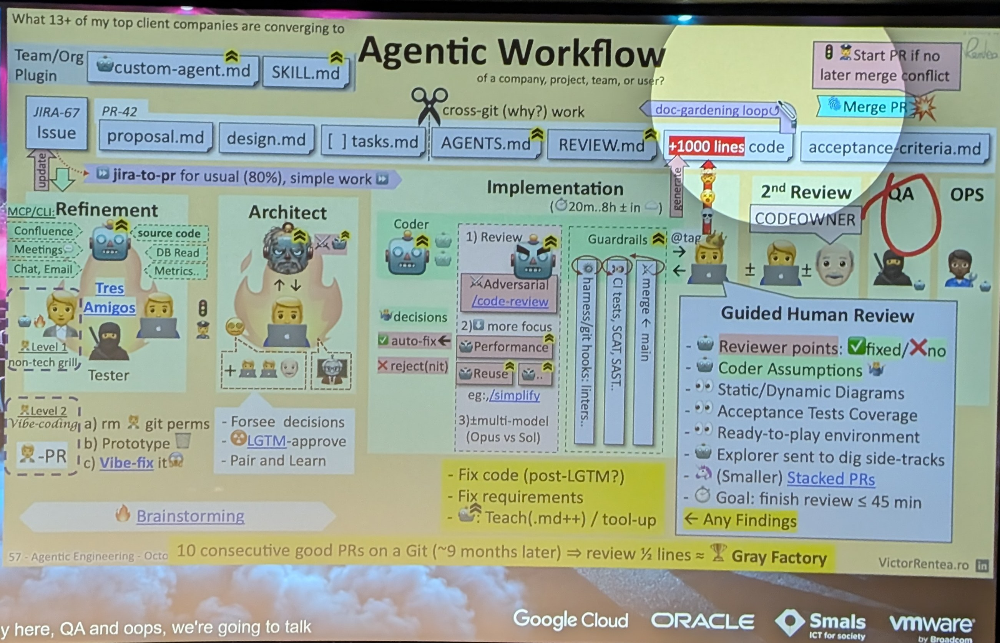

### [2:30:00](https://youtu.be/C10mZ3pCnGo?t=9000)
- Sosial test

### [2:38:47](https://youtu.be/C10mZ3pCnGo?t=9527)
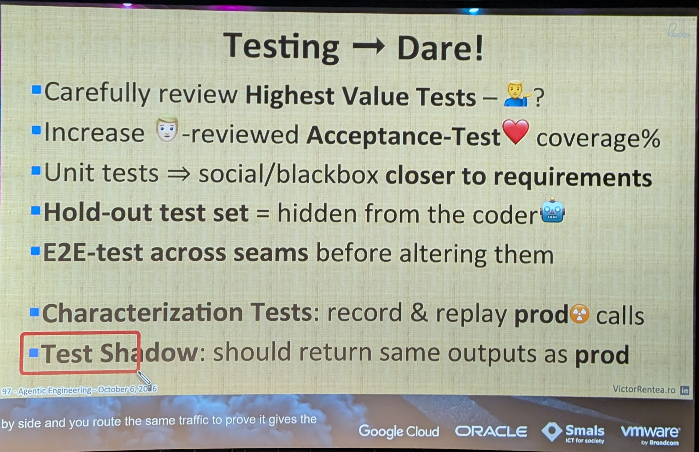

### [2:40:00](https://youtu.be/C10mZ3pCnGo?t=9600) ⭐
- Refactoring
- every post is important

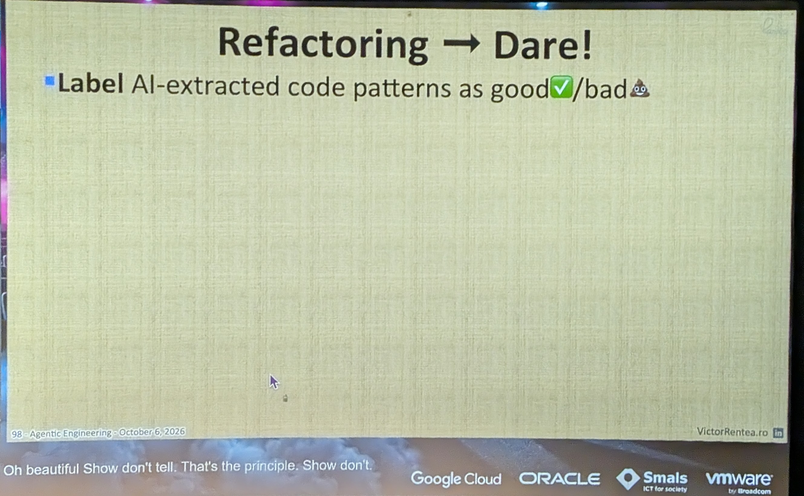

### [2:40:00](https://youtu.be/C10mZ3pCnGo?t=9600) [?] ⭐
- QA
- Same as Refatoring

### [2:47:39](https://youtu.be/C10mZ3pCnGo?t=10059)
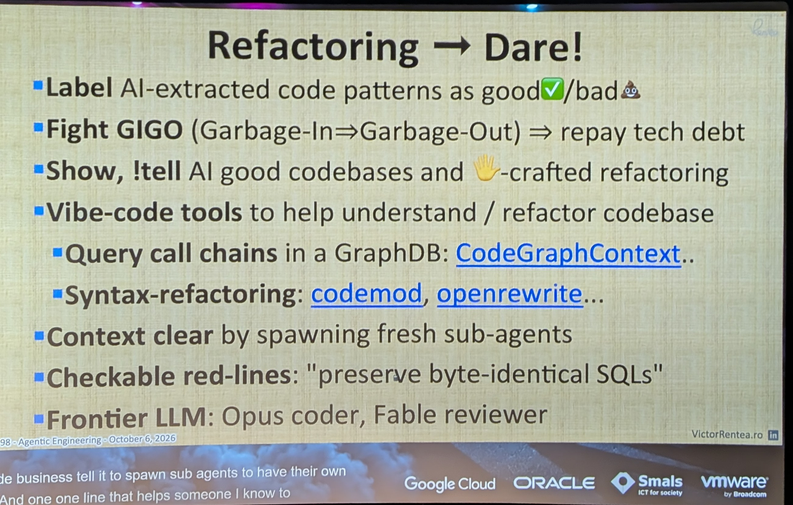

### [2:53:07](https://youtu.be/C10mZ3pCnGo?t=10387)
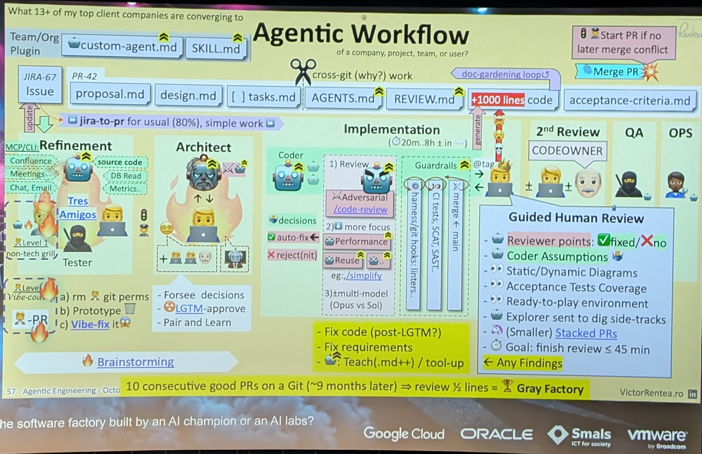

### [2:59:11](https://youtu.be/C10mZ3pCnGo?t=10751)
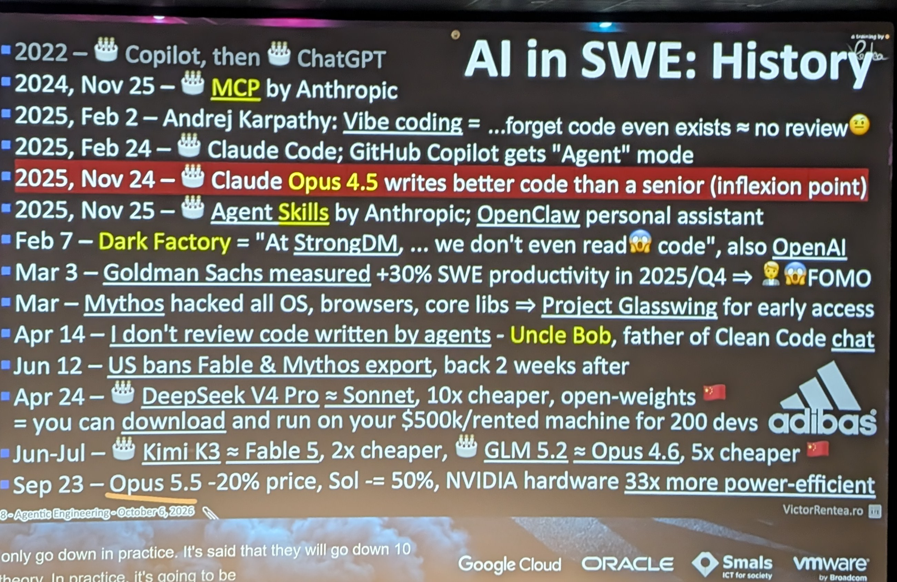

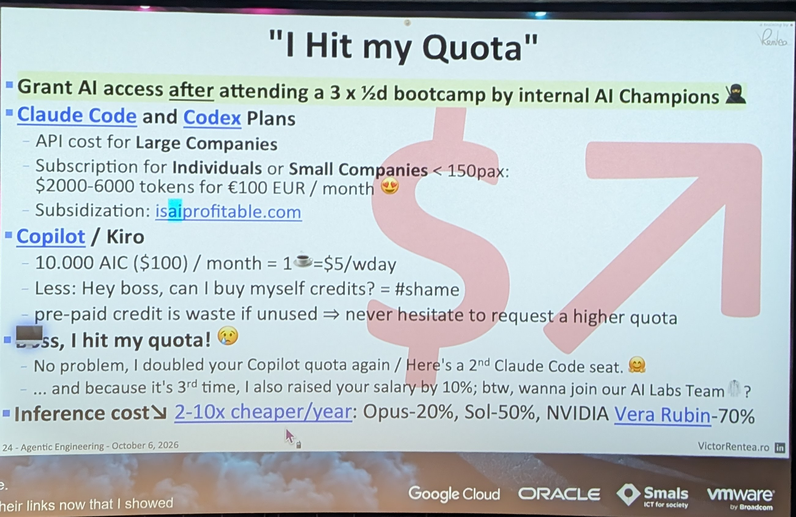

## Extra notes
- ⭐✅ Room 8 · Deep Dive · 210 favoris
- Le workflow vers lequel convergent les équipes les plus avancées : alléger la code review du code généré sans créer de dette cognitive ni éroder les compétences, zone par zone. C'est une trajectoire de maturité réutilisable telle quelle dans un plan d'AI enablement. Rentea forme des équipes à l'agentic engineering.

## My take

