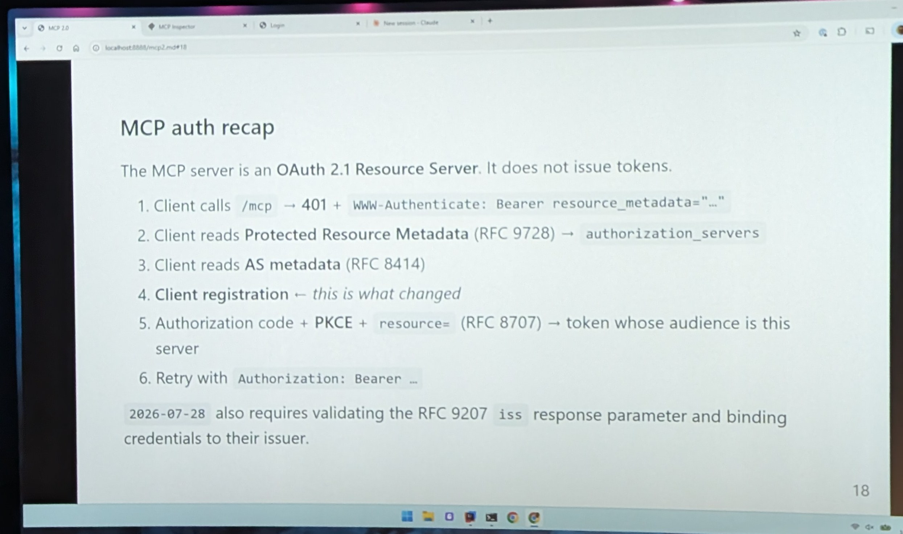
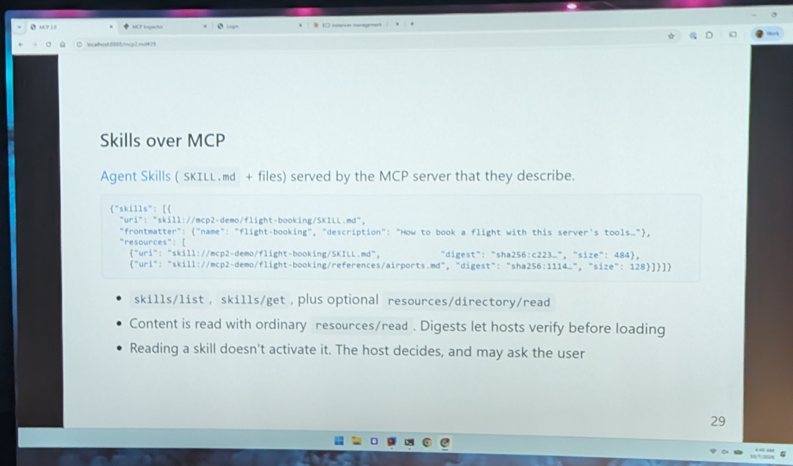
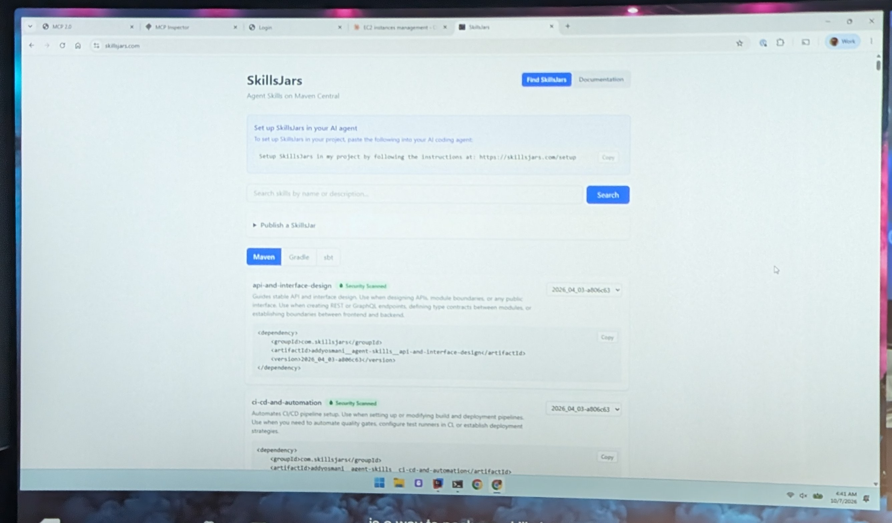
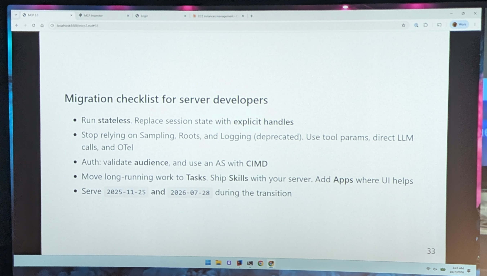

# 12:00 MCP 2.0

[▶ Video](https://youtu.be/fShgG3jtkXQ)

[MCP 2.0 - Stateless, New Auth (CIMD), and Exciting Extensions](https://m.devoxx.com/events/dvbe26/talks/21691/mcp-2-0-stateless-new-auth-cimd-and-exciting-extensions) by [James Ward](https://m.devoxx.com/events/dvbe26/speaker/21535/james-ward)
Room 9 · Conference · 12:00-12:50

## Summary

The session reviews recent MCP spec and implementation changes and their impact on server developers. It covers stateless transport, new CIMD authentication, and extensions like MCP Apps, Tasks, and Skills. Code examples and demos show how to build servers using the latest MCP features and approaches.

## Timeline

- Really specification

### [16:00](https://youtu.be/fShgG3jtkXQ?t=960)
- mcp inspector
  - chrome extation ?

### [22:33](https://youtu.be/fShgG3jtkXQ?t=1353)

### [37:00](https://youtu.be/fShgG3jtkXQ?t=2220)
- skill over MCP
  - Distribution of skill solution
- skill jars

### [40:22](https://youtu.be/fShgG3jtkXQ?t=2422)

### [45:45](https://youtu.be/fShgG3jtkXQ?t=2745)

## My take

