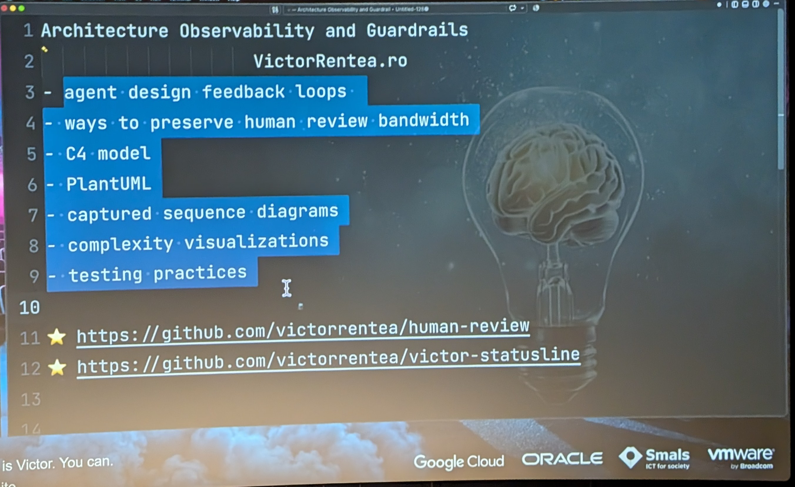
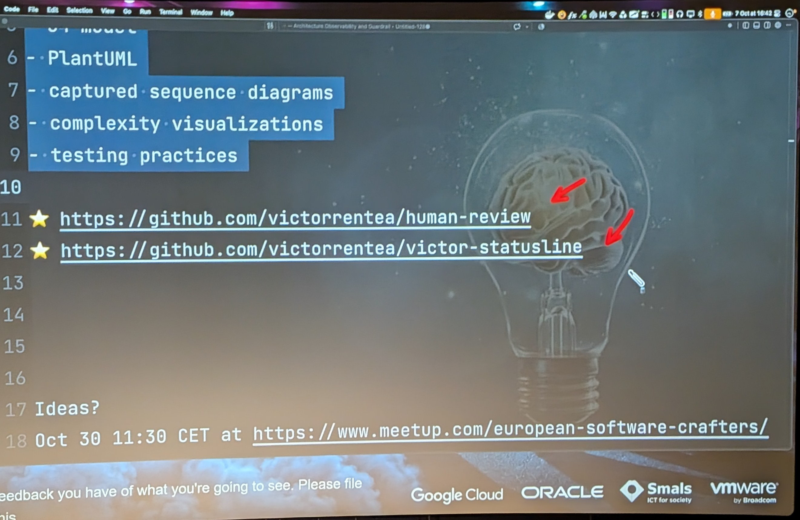
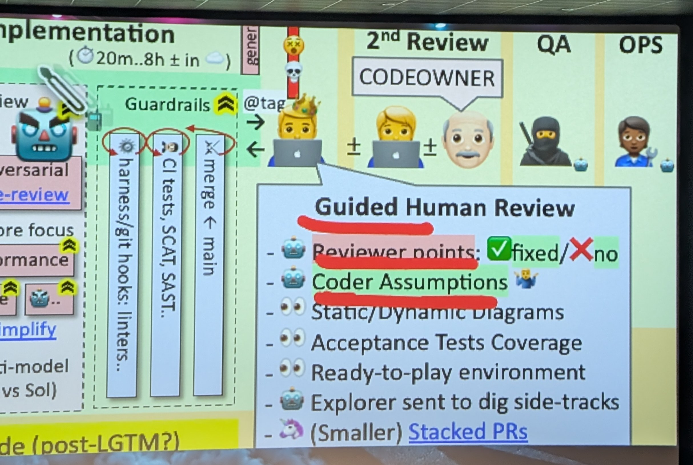
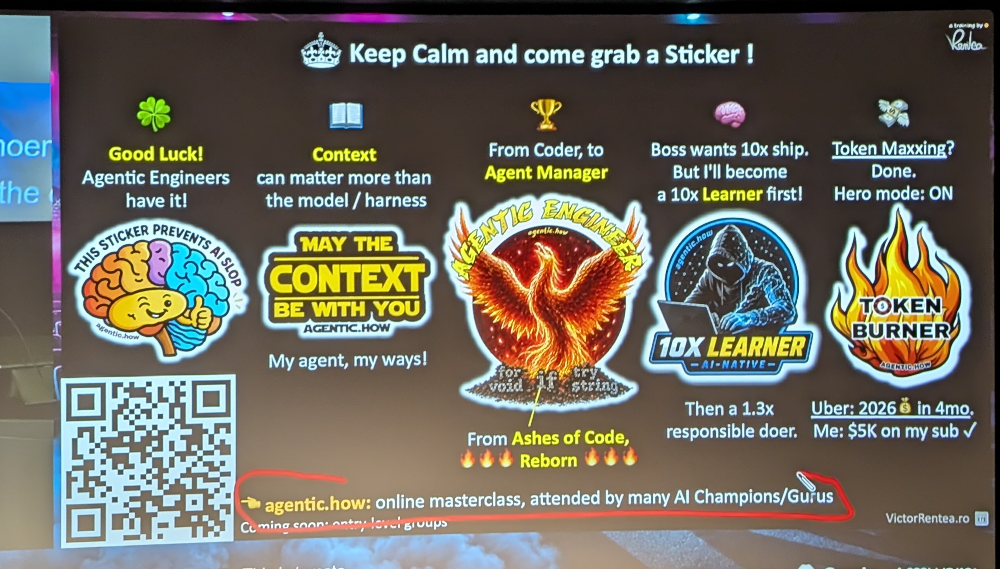

# 16:40 victor

[▶ Video](https://youtu.be/BOcNjR2lBus)

[Architecture Observability and Guardrails](https://m.devoxx.com/events/dvbe26/talks/31453/architecture-observability-and-guardrails) by [Victor Rentea](https://m.devoxx.com/events/dvbe26/speaker/30506/victor-rentea)
Room 8 · Conference · 16:40-17:30

## Summary

Talk on preventing “AI slop” by enforcing code quality in AI-generated codebases. It covers agent design feedback loops and ways to preserve human review bandwidth, using C4 models, PlantUML, captured sequence diagrams, complexity visualizations, and efficient testing practices.

## Key points ⭐

- meetup 30 oct

## Timeline

- ⭐ meetup 30 oct

### [02:07](https://youtu.be/BOcNjR2lBus?t=127)

### [08:30](https://youtu.be/BOcNjR2lBus?t=510)
- Mistral Defense
- spec During the Day
- Agent work During the night

### [13:00](https://youtu.be/BOcNjR2lBus?t=780)
- Test Data fixtures

### [17:00](https://youtu.be/BOcNjR2lBus?t=1020)
- oasdiff [?]

### [20:00](https://youtu.be/BOcNjR2lBus?t=1200)
- Plant UML Generated from static analysis

### [24:00](https://youtu.be/BOcNjR2lBus?t=1440)
- DrawIO png can contains Meta Data with the source <XML> Schema

### [37:00](https://youtu.be/BOcNjR2lBus?t=2220)
- common module
  - ↳ telemetry for lib jar
- @withspan
  - Add span in OTel

### [40:00](https://youtu.be/BOcNjR2lBus?t=2400)
- speaking about Pension SFPD
  - + 200 module

### [40:00](https://youtu.be/BOcNjR2lBus?t=2400)
- plant uml on maven module

### [41:00](https://youtu.be/BOcNjR2lBus?t=2460)
- Ask AI to write a script To create schema

### [42:00](https://youtu.be/BOcNjR2lBus?t=2520)
- code city on thésées [?] ?
- CodeCity https://share.google/OY8QVIKXL4UoApjqY

### [51:38](https://youtu.be/BOcNjR2lBus?t=3098)

## My take

- code city
- PlantUML maven module
- telemetry
